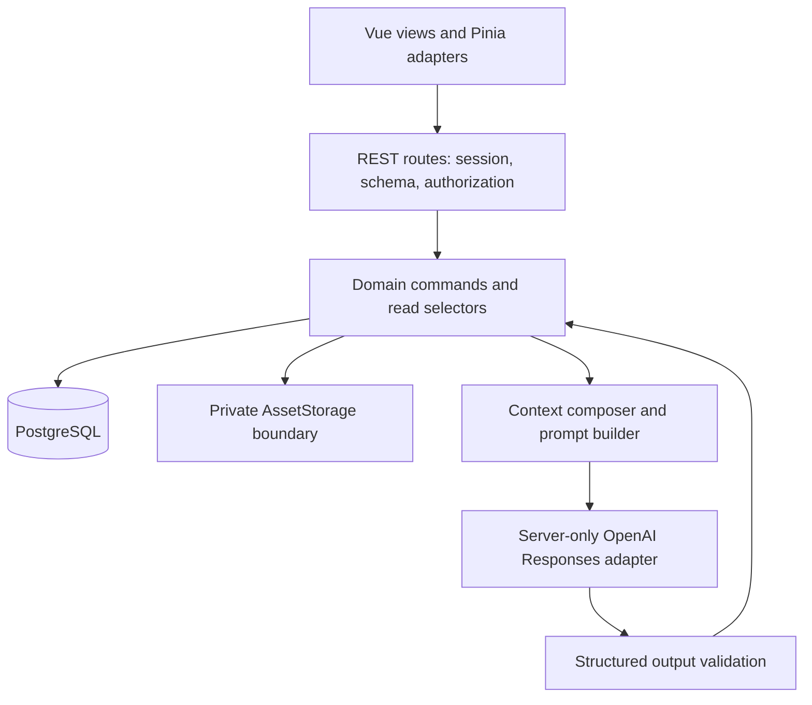

# Shifd Marketing — Backend Architecture

Status: **Proposed architecture and contract, not implementation.** Date: 2026-09-11.
Baseline: user-locked `frontend-v1`; Playwright execution intentionally deferred.
Companion documents: [Database Schema](DATABASE_SCHEMA.md), [API Contract](API_CONTRACT.md).

## 1. Goals and evidence

Translate the internal marketing workflow into durable, authenticated persistence while preserving the approved screens and six-step workflow at `/content/create`. Keep one owner for each business fact and make AI execution traceable for research without claiming causal marketing impact.

Reviewed root/frontend AGENTS instructions, PRD, implementation notes, design rules/decisions, frontend plan/audit (including Final Fix Pass), every current domain type and Pinia store, router/navigation, workflow orchestration, lifecycle/publication selectors, and existing tooling. This architecture records the original D-01 baseline, which selected the Anthropic TypeScript SDK before backend implementation. The current production provider was subsequently migrated to the official OpenAI SDK and Responses API; see [OpenAI Provider Migration](OPENAI_PROVIDER_MIGRATION.md). Phase 6/7/8 and Phase 12 reports remain historical records of their execution dates. `docs/PRD.md` is still empty. Earlier frontend planning proposals are historical; current code and subsequent locked product decisions take precedence. The frontend audit's compatibility mirrors are migration inputs, not database design requirements.

No source code, dependencies, database, credentials, or frontend behavior is changed by this plan. Existing frontend-only restrictions remain in force until a separate implementation task authorizes a phase.

## 2. Scope

Company → optional Product → Idea → Brief → master content/visual direction → platform adaptation → manually produced creative → advisory brand assessment → human approval → schedule → manual publication → measurement.

An internal team operates one company, initially Shifd Labs. Company IDs scope records and access; this is not a multi-tenant SaaS or team-management product. Instagram and LinkedIn are publication platforms; WhatsApp Business is supplementary aggregate inquiry tracking.

## 3. Non-goals

No automatic social posting, AI images, Canva integration, social inbox, OCR, CRM, competitor/trend research, AI predictions, M1/M5/M6 inference, public signup, billing, SSO, microservices, distributed queue, Kafka, Kubernetes, vector database, or premature caching. No production model or provider pricing is implied by legacy mock-fixture labels such as “Claude Sonnet.”

## 4. Recommended stack

| Concern | Primary recommendation | Project rationale |
| --- | --- | --- |
| Runtime/language | Node.js supported LTS + strict TypeScript | Same language as Vue/Pinia domain contracts; existing npm tooling. Pin compatible maintained versions during foundation implementation, not in this proposal. |
| HTTP | Fastify, modular route plugins, JSON Schema request/response validation | Small REST server with explicit schemas and typed handlers; avoids a second large application framework. [Fastify TypeScript](https://fastify.dev/docs/latest/Reference/TypeScript/) and [validation](https://fastify.dev/docs/latest/Reference/Validation-and-Serialization/). |
| Database | PostgreSQL | Relational references, transactions and unique constraints fit approvals, schedules, publications and metrics. JSONB is reserved for small structured documents, not relational IDs. [Constraints](https://www.postgresql.org/docs/current/ddl-constraints.html). |
| Data access | Prisma ORM and reviewed SQL migrations | Typed PostgreSQL access, inspectable schema/migrations. Use SQL migrations for constraints the selected Prisma release cannot express; do not introduce a generic repository for every table. [PostgreSQL connector](https://docs.prisma.io/docs/orm/core-concepts/supported-databases/postgresql). |
| AI | Official OpenAI Node/TypeScript SDK (`openai`) behind one server adapter | Uses the Responses API while isolating provider-specific request/response handling. [OpenAI SDK quickstart](https://developers.openai.com/api/docs/quickstart). |
| Tests | Vitest, Fastify injection, real disposable PostgreSQL integration database; existing Playwright smoke suite later | Builds on frontend testing tools; database concurrency must be tested against PostgreSQL, not SQLite mocks. |
| Deployment | One long-lived Node process, PostgreSQL, private persistent file volume, same-origin reverse proxy | Simple operational model; static Vue assets and `/api` share an origin. No cloud vendor selected. |

These are recommendations based on the repository, not an assertion of the team's undisclosed backend experience. Verify Node/Fastify/Prisma/SDK compatibility and pin versions at Phase 1. Links support capabilities; the architecture choices are project-specific judgments.

## 5. Layered architecture

Routes handle transport, not business rules. Domain commands own transactional invariants. Read selectors compose canonical tables into domain resources; presentation formatting remains in Vue. One application/database connection pool and small domain modules are sufficient. Use an injected clock, storage adapter and AI adapter for deterministic tests. Do not share Pinia objects, browser `File`, `Date` instances or UI component types with the server.

## 6. Domain boundaries and frontend mapping

Fourteen logical domains; these are modules, not independently deployed services.

| # | Domain | Canonical responsibility / frontend owner |
| --- | --- | --- |
| 1 | Identity | Users, password verification, sessions; replaces `authStore` mocks. `workspaceStore.user` becomes a projection of the authenticated identity. |
| 2 | Company Context (M1) | Company/profile, Brand and nine BMC blocks; `companyContextStore`. |
| 3 | Product Context (M1) | Products/profile and dynamic inheritance; `productsStore`. |
| 4 | Ideas and taxonomy | Ready/Used/Archived ideas, fixed pillar/objective codes, source linkage; `contentIdeasStore`. |
| 5 | Content | Saved campaign, Brief, master, direction, variants and editorial progress; `contentLibraryStore`. `contentWorkflowStore` remains an unsaved editing buffer. |
| 6 | Assets | Private image metadata, reusable files, ordered variant attachments and metric evidence. Replaces browser URL ownership for saved files. |
| 7 | Brand Assessment (M4) | Advisory result for an exact platform revision/context input; no approval authority. |
| 8 | Human Review | Checklist, justified overrides, approval/revision decisions tied to content revision. |
| 9 | Scheduling (M5) | Planned platform time and cancellation; no posting job. |
| 10 | Publication | Unique manual publication evidence per variant; feeds all count selectors. |
| 11 | Performance (M6) | Weekly social metrics, supplementary inquiries, shared publication reconciliation; `performanceStore`. |
| 12 | Integrations | Account/source state, future Instagram metrics adapter; `integrationsStore`. |
| 13 | AI Configuration and Execution (M2/M3/M4) | Server model config, language, prompt versions, request logs; `aiSettingsStore`. |
| 14 | Content Audit | Append-only application events describing actual commands; not current state or a cryptographic audit product. |

UI toasts, modal state, step focus, sidebar state and search drafts remain frontend-only. Overview is a read aggregation, not a stored domain/counter table.

## 7. Persistence, lifecycle and data flow

### Saved content and workflow intent

- **New:** local empty Brief, no POST per keystroke. At valid Brief submission beginning generation, POST one saved content with the Brief. The client retains its returned ID for all subsequent writes and retries.
- **Idea:** selecting an idea only prefills local Brief. The first accepted valid content creation stores `sourceIdeaId` and marks Ready → Used in the same transaction. Failure before acceptance leaves the idea Ready. A provider failure after acceptance leaves a recoverable Draft and the idea Used: creation has begun. This matches the prototype's mark-used-at-valid-transition behavior.
- **Resume:** GET the complete canonical content, reset the local workflow buffer, hydrate all available fields. Server `resumeStep` is derived, not stored navigation state.
- **Save:** PATCH whitelisted editorial fields as one aggregate command with a revision precondition. It never accepts publication, schedule, assessment or approval payloads. Dedicated commands own those records. Changing schedule time is never used as an upsert shortcut.

Brief and master have different meanings: topic is a brief idea, title is authored master content. The list title resolves master.title, falling back to Brief.topic; there is no separately writable list title. Company/product names resolve live by ID in every read. Idea relationships resolve from `contents.source_idea_id`, not a second writable `relatedContentId` on ideas.

Product creation is intentionally allowed to produce an incomplete Product Profile. Marketing fields, including campaign objective, remain unset until an operator configures them; no default objective or claims are fabricated. Context-dependent operations validate completeness at their boundary: a Product-context M2/M3/M4 request must reject missing fields with a domain validation error, while catalog browsing, editing and inheritance previews remain available.

### Persist versus derive

Persist `contents.editorial_stage` as draft/generated/adapted/creative_in_progress/ready_for_review/needs_revision; a single `archived_at`; content revision; current approval reference; and child schedules/publications. Stage commands validate their prerequisites. Do not derive editorial stage from the currently viewed wizard step.

Derived lifecycle precedence:

1. `archived_at` present → Archived (publication facts remain countable).
2. At least one enabled variant, and every enabled variant has its PublicationRecord → Published.
3. Any non-cancelled schedule for an enabled, not-yet-published variant → Scheduled (includes mixed Published/Scheduled).
4. Current valid human approval exists → Approved.
5. Map editorial stage to Draft/Generated/Adapted/Creative In Progress/Ready for Review/Needs Revision.

Approval/locked-content rules prevent a Scheduled record with invalid approval. Platform display is Published if its publication exists; otherwise Scheduled or Ready to Publish when active scheduled time is reached. Cancelled describes a cancelled schedule, never failed publication. Calendar excludes archived content and cancelled schedules from actionable upcoming items. No inference, timer or background task changes Published.

Resume mapping: Draft→Brief; Generated→Generate; Adapted→Adapt; Creative In Progress→Creative; Ready for Review/Needs Revision→Review; Approved/Scheduled→Schedule; Published/Archived→Detail. This does not add frontend routes.

### Review integrity and concurrency

Use a content aggregate `revision` (optimistic concurrency) and variant `revision`. Every mutation locks the content row; mismatched `If-Match` gives 412 before writing. Editorial mutations increment the content revision, invalidate its current approval and mark affected assessments stale by revision/input hash. Changes to master mark adaptations stale, without silently overwriting user copy. Track a separate master_revision and each variant’s adapted_from_master_revision; editing Instagram or adding assets must not make LinkedIn stale merely because the aggregate editorial revision advanced. Regenerating Instagram only updates Instagram; shared creative changes affect LinkedIn only while reuse is enabled. Schedule/publication operations bump aggregate revision and preserve valid approval by their reviewed editorial revision reference: keep a separate `editorial_revision` to avoid invalidation from operational writes.

**Approved safe write policy (D-02):** Approved/Scheduled records accept schedule-only edits. Review-affecting mutations return 409 until an explicit Request Revision command is accepted; that command invalidates current approval, cancels unpublished schedules, and preserves existing publications/history. Published platform variants are immutable; duplicate to develop replacement content. Do not silently reset approval or change already published text. Company edits update live context displays but do not rewrite historic approval evidence; a new AI request captures the current resolved context. Assessment freshness compares its reviewed content inputs against current editorial inputs; a later company rename alone does not revoke a historical approval. Re-running M4 uses the then-current context and requires review of the new result.

### Manual publication transaction

Authenticate → authorize company → lock content then variant/schedule → validate active schedule and reviewed revision → upsert by unique variant ID → record human actor/time and event → derive campaign status → commit → return updated content/publication. On retry, return the same publication ID; edits to publishedAt/postUrl update the record and create a correction event. Snapshot scheduledAt at first publication; it is historical evidence, not another editable schedule. Never update WeeklyMetric counters when publishing.

## 8. AI request flow

1. Authenticated M2/M3/M4 command with content revision and idempotency key.
2. Validate stored inputs, enabled platform, write eligibility, and company authorization.
3. In a short transaction create pending request log and capture input/editorial revisions, resolved context, prompt version, model ID, language and schema version.
4. Release database transaction. Compose prompt with explicit boundaries between instructions and user/company/product content. No tools or external browsing by the model.
5. Call OpenAI's Responses API server-side with model `gpt-5.6-luna`, bounded timeout/token budget, low reasoning effort, `store:false`, and SDK retries disabled. No DB lock is held during network I/O.
6. Request strict, server-owned JSON Schema Structured Outputs for M2/M3/M4, then validate the result again against the existing domain schemas and semantic constraints; reject refusals, truncation, missing/invalid fields. Provider schema enforcement does not replace application validation. [Responses API](https://developers.openai.com/api/reference/cli/resources/responses/methods/create), [GPT-5.6 Luna capabilities](https://developers.openai.com/api/docs/models/gpt-5.6-luna).
7. Re-lock and compare captured revisions. If inputs changed, store a stale/failed request outcome without overwriting the content; return 409. Otherwise save result, increment affected revisions and finalize request usage/event atomically.
8. Return the canonical updated content plus request ID. M4 only saves an assessment; the human approve endpoint remains separate.

M2 returns master `{title,coreMessage,hook,body,cta}` and direction `{format,concept,structure,notes}`. M3 targets **one platform per request** and returns `{copy,cta,hashtags,visualRecommendation}`; the adapter maps copy to Instagram caption/LinkedIn postCopy. M4 targets one variant, returns score 0–100, advisory status/recommendation and pass/warning checks. It assesses copy/context and provided visual direction, not an unimplemented visual certification. No M1/M5/M6 AI endpoint exists.

Use synchronous HTTP initially with pending logs and timeout recovery, not a job platform. Duplicate pending requests return 409/request ID, never trigger an extra paid call. Failed/unknown outcomes require explicit retry; provider execution cannot be promised exactly-once after a network/process failure. A timeout may incur usage even when no output was persisted. Missing usage/cost is null, not zero. Server startup can mark interrupted pending attempts failed/unknown without re-running them.

Prompt templates live in version-controlled server resources. DB metadata stores version and template digest, not editable production system prompts. Request logs record the exact versions plus a protected input snapshot for reproducibility; snapshots are historical execution evidence only, never inherited live context. Public log responses exclude raw prompts/input snapshots and secrets. Cost uses one server calculator and a versioned rate snapshot (or null if unknown); do not claim demo costs are real research expenditure.

## 9. Authentication approach

Recommend opaque server sessions in PostgreSQL, not JWTs in browser storage. Generate a high-entropy session token after password verification, rotate at login, store only its hash and expiry server-side, and send `HttpOnly; Secure; SameSite=Lax; Path=/` cookie with no Domain. Same-origin deployment keeps this simple. Session cookies have no persistent Max-Age by default; server-side idle/absolute expiry applies. Exact durations remain a D-05 configuration decision and are not fixed here.

Use Argon2id password hashing with maintained library defaults calibrated on deployment hardware, following [OWASP password guidance](https://cheatsheetseries.owasp.org/cheatsheets/Password_Storage_Cheat_Sheet.html). Protect session cookies and rotate/revoke sessions following [OWASP session guidance](https://cheatsheetseries.owasp.org/cheatsheets/Session_Management_Cheat_Sheet.html). Seed the first internal user through a restricted operator command using supplied credentials, never demo password123. Disable users instead of deleting actors. No signup/reset/email-verification API; operator-assisted password reset revokes existing sessions.

Every API except login/liveness requires a session; mutating requests require an Origin check and CSRF token. Login also requires a same-origin check and rate limit to prevent login CSRF/brute force. `/auth/me` bootstraps identity/CSRF on refresh. Logout revokes only the session; application records remain. All initial internal founder users have the same editing/review permissions; server operator configuration is not an extra product role screen.

## 10. Creative asset boundary

`AssetStorage.put/read/delete` accepts/returns streams and opaque storage keys. Initial recommendation is a private persistent disk volume outside the web root, with an authenticated download endpoint. Future object storage can implement the same interface; no vendor provisioned now. Store metadata in PostgreSQL, binaries in storage; URLs are generated responses, not durable IDs.

Validate PNG/JPEG signature and MIME, bounded byte size and decoded dimensions; never trust filename/path. Keep originals immutable, generate random storage keys, prevent traversal, reject SVG/HTML. File limits remain a configurable technical proposal requiring confirmation (D-05); no unapproved carousel limit is inferred from Stitch. LinkedIn reuse points to the Instagram variant's collection, preserving order dynamically; duplicate content may reference the same immutable asset IDs without copying files. Removing an attachment cannot delete a file used by any other variant or metric evidence. Archive never purges files.

Upload file first into temporary storage, validate, persist ready metadata, then attach transactionally. Clean failed/unattached uploads after a grace period; cleanup must check all attachment/evidence references under a lock. Request cleanup or a simple operator maintenance command suffices, no distributed worker. Browser object URLs remain temporary preview aids only and cannot be imported as persisted files.

## 11. External integration boundary

SocialAccount stores platform, handle, reporting timezone, source mode, status and last successful sync. A disconnected Instagram account retains all metrics and publications. LinkedIn is manual; WhatsApp is manual inquiries only. Instagram Graph API is a **future metrics-only adapter**; provider permissions and available metric definitions must be checked when that integration is authorized. No OAuth or sync job is implemented/planned as a foundation prerequisite.

The mock integration adapter may preserve connect/sync/disconnect demos in non-research environments, explicitly returning `mode:demo`; it never fabricates metric values. An unconfigured real adapter returns `INTEGRATION_NOT_CONFIGURED`, not success. Last real sync advances only after metrics persistence. Future credentials stay in server secrets configuration, referenced by opaque account configuration, never returned by settings endpoints.

## 12. Error handling

One envelope: `{error:{code,message,fields?,requestId}}`. Use 400 malformed data, 401 unauthenticated, 403 CSRF/action denial, 404 absent/inaccessible IDs, 409 state/duplicate conflict, 412 stale revision, 413 oversized upload, 415 invalid media, 422 field/domain validation, 428 missing precondition, 429 throttled, 502 invalid/provider failure, 503 unavailable, 504 timeout. Never return SQL, stack traces, provider secrets or raw prompts. Preserve local unsaved edits on failure. Transaction errors roll back all related writes.

## 13. Validation and time

Schemas reject unknown writable fields. Never accept client actor IDs, status rollups, scores from approval requests, server model selection or arbitrary storage paths. Company/product references must belong to the session company. Brief requires context, pillar, objective, audience/topic, plus product for product context. Validate supported enumerations, real dates, nonnegative integer metrics and HTTP(S) optional URLs.

Store instants as UTC `timestamptz`, exchange RFC3339 with offset, and store IANA zone on company/schedule/account. D-04 approves `Asia/Jakarta` as the reporting timezone. New research weekly metrics use Monday 00:00 through the next Monday 00:00, represented internally as `[Monday 00:00, next Monday 00:00)` in that timezone; they cannot overlap for the same social account. Legacy/demo rows may retain original intervals during migration. Never infer a timezone from a machine's UTC date.

## 14. Logging and audit

Content events record accepted command, actor, time, content/variant, related record ID and concise metadata in the same transaction. Do not reconstruct state from events or fabricate lifecycle events on each GET/upsert. Assessments, approval actions, publications and request logs retain their own facts. HTTP logs carry request IDs and redacted route/status/latency; omit passwords, cookies, body copy, images and tokens. Failed authentication belongs to server operational logs, not a fictional content event.

## 15. Security

Server authorization applies to every referenced ID including files, evidence, AI logs and child variants. Do not trust frontend route guards or passed company IDs. Restrict database privileges, enforce HTTPS, redact sensitive data, use fixed provider hosts, and never fetch user-supplied post/product URLs. Uploaded/AI text is treated as untrusted content. Bound upload/prompt/request size and login/AI request frequency. No “immutable,” compliance or encryption-status claims are added to the product UI.

## 16. Configuration and secrets

Server environment/host secrets: database URL, session/CSRF configuration, optional `OPENAI_API_KEY`, server-selected `OPENAI_MODEL`, storage root, allowed origin, timeout/token limits. Public metadata: provider display label, configured model display, language, prompt versions and readiness. Never serialize environment variables or keys. Current provider metadata is OpenAI / GPT-5.6 Luna; with a missing key or model, the AI execution boundary returns `AI_NOT_CONFIGURED`. Separate test/demo data from research runs using an explicit dataset/source flag; mock usage must never become measured cost.

## 17. Performance contract

One reporting service backs Overview and Performance. Explicit unique publications remain evidence; weekly `reportedPublishedPosts` is historical/manual aggregate input only. For each nonoverlapping account/week interval: `effective=max(explicit unique posts in interval, reportedPublishedPosts)`. Add explicit publications outside all intervals once. Never add both inside a week. Return explicit/reported/effective counts and basis; a new publication below a larger manual aggregate may not change the effective KPI, but explicit/recent counts always change. This is deliberate compatibility, not perfect attribution.

Engagement rate = `(likes+comments+saves)/impressions*100`, null for zero impressions (frontend may render its existing —/0 presentation). Consistency = effective posts / (2 × requested weeks) × 100 per platform; preserve raw >100%, cap only visual bars. Cadence defaults to canonical service configuration 2/platform/week; no cadence table/editor until configurable targets are authorized.

WeeklyMetric owns end-of-week followers, reach, impressions and engagement inputs. Follower change in frontend-v1 compares earliest and latest available end-of-week observations; label dates in the contract, not an invented start-of-period measurement. Return separate platform follower series. Combined reach is a sum of platform reach, never unique cross-platform people. Weighted combined engagement uses summed numerators/denominators, not mean percentages.

The API explicitly distinguishes latest recorded N intervals (the current Performance behavior), current local week (Overview execution), and fixed latest-eight snapshot (Overview). Overview’s existing Published KPI is all-history, distinct from that snapshot; retain an explicit all_history basis until a separate period-alignment decision. It returns coverage dates/period basis. Do not silently convert recorded-period selection into rolling calendar weeks; D-04 addresses gaps, overlap and partial intervals. For compatibility queries, include entire metric intervals; never prorate a reported count across a clipped interval. Pure explicit publication queries support arbitrary half-open date ranges.

Recent content comes from publications; join account metrics whose interval contains the publication date in reporting zone, not the latest metric. Label `platformMetricsForPublicationWeek`; missing metrics are null and never attributed as post-level results. No `post_metrics` table until real per-post observations exist.

Execution summary uses schedule-cohort membership: planned = active schedules in period; publishedWithinCohort = those having a publication; pending = those without one. Publication-period totals are separate. On-time is publishedAt <= scheduledAtAtPublication, not all published posts. This correct semantic definition is proposed for backend integration and requires explicit adapter acceptance because the prototype uses simpler summary approximations; no frontend change is made here. Content Output counts campaigns and declares its period/basis separately.

## 18. Migration strategy

Create reviewed incremental PostgreSQL migrations only after approval to implement. Bootstrap fixed taxonomy, company, empty nine BMC blocks, server prompt metadata and an operator-created user. Demo fixtures are opt-in and labeled; never import mock request costs as real runs. No automatic migration of all browser state: transient object URLs have no recoverable binary after their session.

A one-time optional fixture adapter maps slug/time-based frontend IDs to UUIDs, normalizes pillar/objective codes, imports one variant per content/platform, one schedule per variant, and one publication per variant. Treat normalized `lifecycle` and explicit publication records as authoritative; ignore deprecated top-level mirrors and event descriptions. If sources disagree, report/reconcile manually instead of silently fabricating facts. Resolve actor IDs and reject unverifiable strings such as “Current session” as timestamps. Missing original files require re-upload or explicit absent assets. Legacy metric intervals require overlap/date review before inserting.

## 19. Frontend integration strategy

Keep routes and product behavior frozen during this documentation task. Later introduce typed API adapters at existing store boundaries; derive legacy display fields in one frontend adapter only. Browser state is an edit buffer/cache, server response is saved truth. Commands return updated aggregate/revision, then invalidate/refetch Content, Calendar, Performance and Overview selectors without synchronizing duplicate counters. No server push infrastructure required.

Auth moves from sessionStorage identity to `/auth/me`; remove mock credential checks. Context updates invalidate resolved product reads; names stay live. Asset records use authenticated content URLs, never browser File objects in JSON. Separate mutation methods prevent workflow PATCH from overwriting publications. Preserve new/from-idea/resume actions and the six Pinia-managed steps. No exhaustive UI redesign or component split is required.

## 20. Decisions to confirm before affected implementation

| ID | Decision | Proposed default / consequence |
| --- | --- | --- |
| D-01 | Stack and deployment | **APPROVED BASELINE:** Node.js + strict TypeScript, Fastify, Prisma, PostgreSQL, official SDK behind a provider adapter, modular monolith, with SQL migrations for PostgreSQL constraints Prisma cannot express cleanly. Original Phase 6 provider was Anthropic; the current provider is OpenAI per [the provider migration](OPENAI_PROVIDER_MIGRATION.md). |
| D-02 | Editing reviewed/scheduled content | **APPROVED:** Approved/Scheduled review-affecting edits require explicit Request Revision; approval is invalidated, unpublished schedules cancelled, publications/history preserved; published variants immutable. |
| D-03 | Creative eligibility | **PRESERVE FOR NOW:** retain frontend-v1's conditional creative gate; reassess before Human Review backend implementation. Do not add a stricter asset requirement during foundation work. |
| D-04 | Reporting time/intervals | **APPROVED WITH REVISION:** Asia/Jakarta; new research rows must use Monday–Sunday boundaries as `[Monday 00:00, next Monday 00:00)` with no same-account overlap. Legacy/demo intervals may be retained for migration. |
| D-05 | Operational limits/retention | **PHASE-SPECIFIC / UNRESOLVED:** do not fix upload limits, retention, session durations, AI spend limits, or a model ID here; decide before each affected implementation phase. |
| D-06 | Requirements source | **APPROVED / RATIFIED BASELINE:** the locked `frontend-v1`, Implementation Notes, Backend Architecture, Database Schema, API Contract, and documented thesis artifact scope are the acceptance baseline. `docs/PRD.md` remains empty and is not used as a source of invented requirements. |

D-01, D-02, D-04, and D-06 are approved for implementation planning. D-03 is intentionally preserved pending reassessment. D-05 remains phase-specific and must be decided before its affected implementation phase. No coding is authorized by this document.

## 21. Implementation phases

| Phase | Deliverable | Exit evidence |
| --- | --- | --- |
| 1 | Implement approved D-01 foundation: server skeleton, schema conventions, PostgreSQL migrations, error/health handling | Typed schema validation and real DB test transactions. |
| 2 | Internal auth, session/CSRF, operator bootstrap | Login/logout/expiry/authorization tests; no demo credentials. |
| 3 | M1 company/brand/BMC/products and context composition | Nine blocks, dynamic inheritance, live names and isolated tone override. |
| 4 | Ideas, Brief/content/variants, new/resume/duplicate/archive persistence | Stable IDs, validation, atomic idea linkage, optimistic concurrency. |
| 5 | Asset storage boundary, attachments/order/reuse, evidence upload | Shared file remains valid after reset/duplicate; no orphan deletion of referenced assets. |
| 6 | M2 generation, prompts/logs/idempotency | Validated output, provider failures/stale writes tested, no implicit approval; current provider is OpenAI. |
| 7 | M3 one-platform adaptation | Independent variants; regeneration never overwrites other platform. |
| 8 | M4 advisory assessment | Revision-bound assessments, warning/recheck traceability. |
| 9 | Implement approved D-02 human review, schedules/manual publication; reassess D-03 creative eligibility before this phase | Approval gate, per-platform uniqueness/concurrency and mixed status tests. No stricter asset gate is added during foundation work. |
| 10 | Implement approved D-04 weekly manual metrics/inquiries and reporting selectors | Asia/Jakarta Monday–Sunday validation, reconciliation, week attribution, zero-denominator and period tests. Instagram stays behind adapter. |
| 11 | Store-by-store frontend adapters and settings/Overview reads | Same frontend-v1 behavior; all screens read durable canonical data. |
| 12 | Integration/regression, migration/restore exercise | Existing unit contracts plus API/DB tests; run deferred Playwright in a supported environment. |

Each phase requires its own implementation authorization. Frontend adapter contracts should be checked alongside each domain even though full switch-over is Phase 11.
