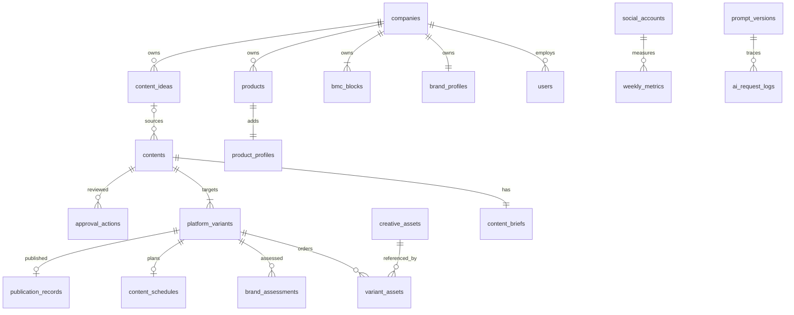

# Shifd Marketing — Proposed Database Schema

Status: planning only, 2026-09-11; no DDL/migrations executed. Baseline `frontend-v1`.
See [Architecture](BACKEND_ARCHITECTURE.md) for lifecycle, decisions D-01–D-06 and phases; [API Contract](API_CONTRACT.md) for transport shapes.

## Conventions

Recommend PostgreSQL. Twenty-seven initial tables are described below; `company_profiles` is consolidated into `companies`, and `post_metrics` is explicitly deferred. Fourteen logical domains do not require fourteen services.

- Unless explicitly stated, `id uuid` is the primary key, generated once on creation. API IDs are opaque UUID strings, never names/slugs. Old frontend IDs are adapter inputs only.
- `!` = NOT NULL; `?` = nullable. All listed columns are required unless marked `?`. `text[]`/JSONB list fields default to empty lists. Empty optional form strings normalize to null; required text is trimmed and nonblank.
- Mutable tables have `created_at timestamptz!`, `updated_at timestamptz!`, `version integer! DEFAULT 1` with positive check, unless otherwise stated. Versions supply ETag preconditions. Append-only evidence tables explicitly state their timestamps.
- Instants use UTC timestamptz, civil metric days use `date`, time zones use validated IANA strings. Date ranges are inclusive inputs and half-open query intervals.
- Foreign keys are indexed unless covered by a leading PK/unique index; PKs and unique constraints generate indexes. All FKs default **ON DELETE RESTRICT**, including actor references; users deactivate, products become Inactive, content/ideas archive. No public hard deletion.
- Every root belongs to a company. Child authorization traverses the root. Cross-company references are rejected by domain transactions, with composite FKs where noted. A browser-provided company ID never grants access.
- Text CHECK values, rather than duplicate lookup tables, represent small fixed enums. Business queries never use free-form display labels as statuses.
- Keep SQL-specific partial/exclusion/composite constraints in reviewed migrations if the ORM cannot express them. No opaque ORM-only guarantee replaces the database uniqueness of publications.

## 1. companies — company identity and profile

**Purpose:** one canonical company/profile owner; company_profiles would be a mandatory one-to-one with no separate lifecycle and is not created.

**PK:** `id`. Columns: `name text!`, `description text!`, `industry text?`, `business_types text[]!` (subset B2B/B2G), `primary_market text?`, `website text?`, `mission text?`, `vision text?`, `positioning text?`, `core_value_proposition text?`, `differentiators text[]!`, `customer_segments text[]!`, `decision_makers text[]!`, `pain_points text[]!`, `reporting_timezone text! DEFAULT 'Asia/Jakarta'`, `context_version integer!`, standard timestamps/version.

**Constraints/indexes:** positive context_version; nonblank name/description. No uniqueness on human-readable name; PK is identity. Context version increments for any company/brand/BMC edit in one transaction. **Deletion:** restricted by all children. One configured internal company initially; no workspace/tenant provisioning endpoints.

## 2. users — internal authenticated actor

**PK:** `id`. Columns: `company_id uuid! FK companies`, `name text!`, `email text!`, `password_hash text!`, `role text!` (initially founder), `active boolean! DEFAULT true`, standard timestamps/version.

**Constraints/indexes:** unique lower(email), index company_id. Only password hash; never plaintext, mock passwords or bearer keys. **Deletion:** restrict; deactivate to preserve human review/publication attribution. Role is a modest authorization field, not team/billing management.

## 3. auth_sessions — revocable opaque sessions

**PK:** `id`. Columns: `user_id uuid! FK users`, `token_hash text!`, `csrf_secret_hash text!`, `created_at timestamptz!`, `last_seen_at timestamptz!`, `expires_at timestamptz!`, `absolute_expires_at timestamptz!`, `revoked_at timestamptz?`.

**Constraints/indexes:** unique token_hash, expiry index and user_id index, expiry > created_at. No standard version needed. **Deletion:** user FK CASCADE is acceptable for operator removal of unused test users; deleting sessions affects no business records. Expired/revoked sessions may be purged by simple maintenance.

## 4. brand_profiles — communication rules

**PK/FK:** `company_id uuid REFERENCES companies` (no extra id).
Columns: `brand_voice text?`, `tone_description text?`, `preferred_language text!` (English/Indonesian), `communication_guidelines text[]!`, `preferred_terms text[]!`, `things_to_avoid text[]!`, `cta_style text?`, `brand_keywords text[]!`, standard timestamps/version.

**Constraints/indexes:** one row/company via PK. **Deletion:** restrict. Save increments company.context_version. Form may be incomplete; AI readiness reports missing guidance instead of inventing context.

## 5. bmc_blocks — nine structured context blocks

**PK:** `id`. `company_id uuid! FK companies`, `type text!`, `entries text[]!`, standard timestamps/version.

Type enum: key-partners, key-activities, key-resources, value-propositions, customer-relationships, channels, customer-segments, cost-structure, revenue-streams.

**Constraints/indexes:** unique(company_id,type), CHECK allowed type. Seed/create all nine transactionally; PUT must contain exactly nine distinct types. Labels are static taxonomy, not mutable data. **Deletion:** restrict; no per-block DELETE. Empty entries are valid editable context, not missing blocks.

## 6. products — product identity

**PK:** `id`. `company_id uuid! FK companies`, `name text!`, `slug text!`, `description text!`, `category text?`, `status text!` (active/inactive/draft), `url text?`, standard timestamps/version.

**Constraints/indexes:** unique(company_id,slug), unique(company_id,id) for composite references, index(company_id,status). Slug is not API identity. **Deletion:** restrict; update status to inactive. Name updates do not rewrite contents or AI logs.

## 7. product_profiles — product-specific overlay

**PK/FK:** `product_id uuid REFERENCES products`. Columns: `target_users text[]!`, `target_organizations text[]!`, `decision_makers text[]!`, `problems_addressed text[]!`, `value_proposition text?`, `features text[]!`, `benefits text[]!`, `differentiators text[]!`, `use_cases text[]!`, `campaign_objective text?`, `positioning text?`, `key_messages text[]!`, `proof_points text[]!`, `default_cta text?`, `inherit_company_tone boolean! DEFAULT true`, `tone_override text?`, standard timestamps/version.

**Constraints/indexes:** when non-null, objective is awareness/education/engagement/credibility/consideration/discovery. A newly created profile may be incomplete and has no invented objective or marketing claims; Product Context editing may save null until explicitly configured. Product-context AI operations validate the required profile fields at the operation boundary. Proof points default empty. No company brand/BMC copies. Brand voice resolves current company voice unless inheritance is off and override is nonblank; otherwise current company voice is the fallback, matching frontend. CTA style/language still inherit. **Deletion:** restrict. Product/profile update is one transaction, incrementing products.version too.

## 8. content_pillars — shared fixed taxonomy

**PK:** `code text` (stable code, not UUID). `label text!`, `sort_order integer!`, `active boolean!`.

Codes map once from existing frontend options: educational, problem, product, use-case, industry, thought-leadership, company. These match `frontend/src/data/contentBrief.ts`; map legacy saved display labels to these existing codes during migration. Labels: Educational, Problem / Pain Point, Product Insight, Use Case, Industry Insight, Thought Leadership, Company / Brand.

**Constraints/indexes:** unique label, unique sort_order; no timestamps required for initial static taxonomy. **Deletion:** restrict when referenced. Objectives stay fixed CHECK vocabulary, no editable taxonomy feature added.

## 9. content_ideas — pre-content backlog

**PK:** `id`. `company_id uuid! FK companies`, `title text!`, `context_type text!` (company/product), `product_id uuid?`, `pillar_code text! FK content_pillars`, `objective text!`, `target_audience text?`, `notes text?`, `status text!` (ready/used/archived), `created_by uuid! FK users`, standard timestamps/version.

**Constraints/indexes:** product context iff product_id nonnull; composite FK(company_id,product_id)→products(company_id,id); unique(company_id,id); index(company_id,status,updated_at,id). Search via bounded case-insensitive text filters initially, no search service. **Deletion:** archive only. Related content is queried through contents.source_idea_id, no circular related_content_id copy. Restore→Ready matches frontend even if historical related content exists.

## 10. contents — canonical saved campaign

**PK:** `id`. `company_id uuid! FK companies`, `source_idea_id uuid?`, `context_type text!`, `product_id uuid?`, `editorial_stage text!`, `editorial_revision integer! DEFAULT 1`, `master_revision integer! DEFAULT 0`, `design_status text!` (not_started/in_progress/ready), `current_approval_id uuid?`, `archived_at timestamptz?`, `created_by uuid! FK users`, `master_content jsonb?`, `visual_direction jsonb?`, standard timestamps/version.

Master JSON: title/coreMessage/hook/body/cta (required strings when present). Direction JSON: format/concept/structure:string[]/notes. These one-to-one documents do not warrant independent tables; validate their exact shape in application schemas. No master fixture label/id, rendered HTML, compatibility schedule/publication fields or browser workflow step.

**Constraints/indexes:** positive editorial_revision; allowed stages draft/generated/adapted/creative_in_progress/ready_for_review/needs_revision; context/product CHECK plus composite product/company FK; composite company/sourceIdea FK→content_ideas(company_id,id). Index(company_id,archived_at,updated_at,id), source_idea_id index. current_approval_id FK→approval_actions; enforce same content/action=approve via transaction (composite content/id FK supported by approval table). Insert content with null pointer, then approval action, then pointer; no insert cycle.

**Derived:** title from master or brief topic; campaign status from archive/publications/schedules/current approval/stage. **Deletion:** archive; all business evidence retained. Aggregate `version` changes on any command; editorial_revision only on reviewed input changes. This avoids invalidating approval merely because publication was recorded. master_revision increments only when master content changes; variant adaptation freshness compares this dedicated counter, so a later adaptation of the other platform does not invalidate the first.

## 11. content_briefs — required structured brief

**PK/FK:** `content_id uuid REFERENCES contents`.
`pillar_code text! FK content_pillars`, `objective text!`, `target_audience text!`, `topic text!`, `angle text?`, `additional_instructions text?`, standard timestamps/version.

**Constraints/indexes:** nonblank audience/topic, objective CHECK. Context and product ID live on contents only, not copied here. One brief inserted with content transactionally. **Deletion:** restrict. Untouched browser Brief is not inserted; first creation is valid/meaningful, not per keystroke. Composite read DTO combines these fields for the existing Brief UI.

## 12. platform_variants — independent platform copy

**PK:** `id`. `content_id uuid! FK contents`, `platform text!` (instagram/linkedin), `enabled boolean!`, `copy text?`, `cta text?`, `hashtags text?`, `visual_recommendation text?`, `revision integer! DEFAULT 1`, `adapted_from_master_revision integer?`, `reuse_creative_from_variant_id uuid? FK platform_variants`, `current_assessment_id uuid?`, standard timestamps/version.

**Constraints/indexes:** unique(content_id,platform), unique(content_id,id); non-self reuse CHECK; current_assessment_id FK brand_assessments (insert assessment then set pointer). Reuse transaction permits only LinkedIn→Instagram in same content, no cycles. No stored Published/Scheduled/Approved Boolean. **Deletion:** disable instead of delete; cannot disable a published variant or one with active schedule (409; explicit revision handling first). Inactive Instagram collection may remain a reuse source, preserving frontend behavior. A variant row exists even before adaptation, with null copy.

Assessment validity compares variant revision plus captured input hash, not a duplicated mutable result. Custom LinkedIn attachments are retained while reuse is on; reads choose the source collection.

## 13. creative_assets — immutable private file metadata

**PK:** `id`. `company_id uuid! FK companies`, `uploaded_by uuid! FK users`, `purpose text!` (creative/metric_evidence), `file_name text!`, `storage_key text!`, `mime_type text!` (image/png,image/jpeg), `size_bytes bigint!`, `width integer!`, `height integer!`, `checksum_sha256 text!`, `state text!` (ready/pending_delete), `created_at timestamptz!`.

**Constraints/indexes:** unique storage_key; positive size/dimensions; index(company_id,created_at). Do not deduplicate files globally by checksum, leak other-company metadata, persist signed URLs, or store binaries/base64 in rows. **Ownership:** company/uploader own file; attachments establish content/platform relationship, evidence FK establishes metric relationship. **Deletion:** no automatic cascade; actual physical deletion only after checking no variant/evidence references and grace period. Duplicate content can reuse immutable file IDs. Storage key is server-private.

## 14. variant_assets — ordered creative attachment

**PK:** `id`. `variant_id uuid! FK platform_variants`, `asset_id uuid! FK creative_assets`, `sort_order integer!`, `created_at timestamptz!`.

**Constraints/indexes:** unique(variant_id,asset_id), unique(variant_id,sort_order) DEFERRABLE for transactional reorder; CHECK sort_order>=0, asset_id reverse-reference index. Domain enforces matching company and purpose=creative. **Deletion:** detaching deletes this link only; never cascades to asset. Replace = upload new immutable asset then atomic link replacement. No mutable platform/order on shared asset itself. UI order 01… maps zero-based sort order.

## 15. brand_assessments — advisory execution result

**PK:** `id`. `variant_id uuid! FK platform_variants`, `variant_revision integer!`, `input_hash text!`, `ai_request_id uuid! FK ai_request_logs`, `score integer!`, `result text!` (aligned/needs_attention), `recommendation text!`, `checks jsonb!` (array of label and pass/warning), `created_at timestamptz!`.

**Constraints/indexes:** score 0–100, unique ai_request_id, unique(variant_id,id), index(variant_id,created_at). Append-only; stale status derived from revision/hash. **Deletion:** restrict. Request log contains captured company/product context version; no “AI approval” record exists.

## 16. approval_actions — human review and overrides

**PK:** `id`. `content_id uuid! FK contents`, `variant_id uuid? FK platform_variants`, `assessment_id uuid? FK brand_assessments`, `editorial_revision integer!`, `action text!` (approve/request_revision/override), `actor_id uuid! FK users`, `justification text?`, `checklist jsonb?`, `reviewed_variants jsonb?`, `created_at timestamptz!`.

**Constraints/indexes:** unique(content_id,id), index(content_id,created_at). Override requires variant+assessment+nonblank justification, matching current variant/revision/content. Approve requires all five checklist Booleans true and reviewed_variants evidence containing enabled variant IDs/revisions/assessment IDs/override IDs. This structured snapshot is evidence, not a second writable publication/copy state. Request revision requires a reason. Current approval pointer on contents references only an approve action for the same editorial revision. **Deletion:** restrict, actions are append-only. Old overrides stay visible but cannot authorize a changed assessment. Requests are authenticated human actions, not model output.

## 17. content_schedules — planned platform timing

**PK:** `id`. `variant_id uuid! FK platform_variants`, `scheduled_at timestamptz!`, `timezone text!`, `approval_action_id uuid! FK approval_actions`, `created_by uuid! FK users`, `cancelled_at timestamptz?`, `cancellation_reason text?`, standard timestamps/version.

**Constraints/indexes:** unique variant_id (one current schedule row per variant); index scheduled_at WHERE cancelled_at IS NULL. Schedule approval must match same content/current reviewed revision, enforced under content lock. **Deletion:** DELETE API marks cancelled_at; no physical delete. Re-scheduling reuses ID, clears cancellation, and creates event. Published schedules cannot be rescheduled/cancelled. A historical publication retains its scheduledAt snapshot separately for on-time evidence.

## 18. publication_records — canonical manual publication fact

**PK:** `id`. `variant_id uuid! FK platform_variants`, `schedule_id uuid! FK content_schedules`, `scheduled_at_snapshot timestamptz!`, `published_at timestamptz!`, `post_url text?`, `marked_by uuid! FK users`, `recorded_at timestamptz!`, `updated_at timestamptz!`, `version integer!`.

**Constraints/indexes:** unique variant_id, unique schedule_id; index published_at; FK schedule_id/variant_id pair to matching schedule (add unique(id,variant_id) there). Platform/content derive by join, not additional writable copies. Exact repeated confirmation returns this ID; correction updates time/URL with actor/event and precondition. **Deletion:** restrict; no public unpublish/delete action. Snapshot timing set at initial insertion only. No false publication from elapsed scheduled time or metric imports.

## 19. content_events — audit trail only

**PK:** `id`. `content_id uuid! FK contents`, `variant_id uuid? FK platform_variants`, `actor_id uuid? FK users`, `actor_kind text!` (user/system), `event_type text!`, `metadata jsonb!`, `request_id text!`, `created_at timestamptz!`.

**Constraints/indexes:** user actor requires actor_id; index(content_id,created_at,id). Metadata carries concise IDs/reasons, not passwords or binary files. No standard version. **Deletion:** restrict; append-only in application. Events never grant approval or determine publication. Request/publication idempotency prevents duplicate success events.

## 20. social_accounts — scoped metric source configuration

**PK:** `id`. `company_id uuid! FK companies`, `platform text!` (instagram/linkedin/whatsapp), `account_name text?`, `external_account_id text?`, `mode text!` (demo/manual/api), `connection_status text!` (connected/disconnected/manual), `reporting_timezone text!`, `last_successful_sync_at timestamptz?`, `credential_reference text?`, standard timestamps/version.

**Constraints/indexes:** unique(company_id,platform): one current account per platform for this prototype. LinkedIn/WhatsApp manual status; Instagram API allowed only when implemented/configured. Credential reference is an opaque server configuration identifier, not token bytes and not returned by API. **Deletion:** disconnect retains history; no public deletion. No separate competing integrations/weekly account table. Replacing a real account while retaining old metrics needs a later explicit migration, not overwriting identity silently.

## 21. weekly_metrics — recorded social observations

**PK:** `id`. `social_account_id uuid! FK social_accounts`, `week_start date!`, `week_end date!`, `followers bigint!`, `reach bigint?`, `impressions bigint!`, `likes bigint! DEFAULT 0`, `comments bigint! DEFAULT 0`, `saves bigint! DEFAULT 0`, `reported_published_posts integer!`, `source text!` (mock/linkedin_manual/instagram_api), `evidence_asset_id uuid? FK creative_assets`, `notes text?`, `recorded_by uuid? FK users`, standard timestamps/version.

**Constraints/indexes:** all supplied counts >=0; end>=start; unique(account,start,end); exclusion on `(social_account_id =, daterange(week_start,week_end + 1,'[)') &&)` using btree_gist prevents overlap under concurrency. D-04 requires new research rows to be Monday–Sunday, represented as `[Monday 00:00, next Monday 00:00)` in Asia/Jakarta; service validation rejects other boundaries. Legacy/demo rows may retain their original intervals during migration. Only Instagram/LinkedIn accounts; source compatible with account; evidence company/purpose and human actor required for manual records. Index(account,week_start) and evidence_asset_id.

**Deletion:** restrict, edit with version. No post-count write from publication command. `reported_published_posts` is manual/imported compatibility evidence, NOT the canonical count of managed publications. Effective counts use shared max reconciliation, never sum. Missing reach is null, genuine recorded zero is zero; source/coverage accompanies aggregates. Screenshot proves only an attachment exists, no OCR/validation of its contents.

## 22. inbound_inquiry_metrics — supplementary WhatsApp counts

**PK:** `id`. `social_account_id uuid! FK social_accounts`, `week_start date!`, `week_end date!`, `count integer!`, `source text!` (mock/manual), `recorded_by uuid? FK users`, standard timestamps/version.

**Constraints/indexes:** count>=0, end>=start; unique(account,start,end), same nonoverlap exclusion as weekly metrics; account must be WhatsApp, source manual requires actor. **Deletion:** restrict. No contact/customer/message rows, no conversion/CAC attribution, no joining counts to individual content.

## 23. ai_settings — non-secret company configuration

**PK/FK:** `company_id uuid REFERENCES companies`. `provider text!` (anthropic), `model_id text?`, `model_display_name text!`, `generation_language text!` (English/Indonesian), `mode text!` (demo/real), standard timestamps/version.

**Constraints/indexes:** one row/company. Model ID is operator-set, null until an allowlisted real model is selected. User API can edit language only. Secret readiness is runtime-derived, not a stored connected Boolean. **Deletion:** restrict. No prices/keys in public settings. Generation language selects output language; brand.preferred_language remains inherited brand guidance, and the prompt explicitly states the output-language override.

## 24. prompt_versions — immutable prompt metadata

**PK:** `id`. `module text!` (M2/M3/M4), `operation text!` (generate/adapt/brand_check), `version text!`, `status text!` (active/retired), `template_reference text!`, `template_digest text!`, `output_schema_version text!`, `created_at timestamptz!`, `updated_at timestamptz!`.

**Constraints/indexes:** unique(module,version), partial unique(module) WHERE status='active'; CHECK operation matches module. Reference identifies a versioned server resource; template content/digest cannot change for an existing version. **Deletion:** restrict when logs reference it, retire otherwise. No full prompt editor or user activation endpoint. Provider/model snapshot lives on requests, not hard-coded into every screen.

## 25. ai_request_logs — execution evidence

**PK:** `id`. `company_id uuid! FK companies`, `content_id uuid? FK contents`, `variant_id uuid? FK platform_variants`, `requested_by uuid! FK users`, `prompt_version_id uuid! FK prompt_versions`, `module text!`, `operation text!`, `provider text!`, `model text!`, `mode text!` (demo/real), `language text!`, `editorial_revision integer?`, `variant_revision integer?`, `input_hash text!`, `input_snapshot jsonb!`, `input_tokens bigint?`, `output_tokens bigint?`, `estimated_cost_usd numeric(18,8)?`, `cost_basis jsonb?`, `latency_ms integer?`, `status text!` (pending/success/failed/stale), `error_code text?`, `error_message text?`, `provider_request_id text?`, `created_at timestamptz!`, `completed_at timestamptz?`.

**Constraints/indexes:** nonnegative known tokens/cost/latency; module/operation match prompt; index(company_id,created_at,id), index(content_id,created_at), index status for pending recovery. No separate mutable prompt version string. Module/operation duplicate prompt metadata only as checked execution facts, not independent settings. Core endpoints require contentId; nullable supports historic/system-level execution evidence without making new AI operations. Variant, when supplied, must belong to content.

**Privacy:** input snapshot captures exact resolved company/product/brief/copy revisions for research traceability; restricted server storage, never a source for live names, product inheritance or normal API response. Cost basis captures rate version/units/currency; unknown billable usage remains null. No full secret-containing HTTP request, raw stack trace or API key. **Deletion:** restrict during research retention; retention/purge policy D-05.

## 26. request_idempotency — bounded command replay

**PK:** `id`. `company_id uuid! FK companies`, `user_id uuid! FK users`, `key text!`, `method text!`, `path text!`, `request_hash text!`, `state text!` (pending/completed/failed), `response_status integer?`, `response_body jsonb?`, `ai_request_id uuid? FK ai_request_logs`, `created_at timestamptz!`, `expires_at timestamptz!`.

**Constraints/indexes:** unique(company_id,user_id,key), expiry index. Hash includes canonical path/body and version precondition; repeated same key/different request→409. Cached bodies exclude binary/secret data. No success written before domain transaction commits. **Deletion:** expiry maintenance; not business evidence. Permanent publication unique constraint still prevents duplicates after key expiry. AI retries after interrupted execution require explicit action/new key, not transparent billing retries.

## 27. ai_rate_versions — central estimated-cost basis

**PK:** `id`. `provider text!`, `model text!`, `version text!`, `input_usd_per_million numeric(18,8)!`, `output_usd_per_million numeric(18,8)!`, `effective_from timestamptz!`, `source_reference text!`, `created_at timestamptz!`.

**Constraints/indexes:** unique(provider,model,version), nonnegative rates, index(provider,model,effective_from). Server operator-managed, not billing UI. **Deletion:** restrict logically after use; request cost_basis retains the exact version/rates. Start empty until verified pricing is configured; mock estimates remain explicitly mode=demo. If provider cache pricing is later used, version schema and calculator before reporting costs; do not silently use incorrect two-rate estimates. No current production pricing is asserted here.

## Consolidations and excluded tables

| Candidate | Decision |
| --- | --- |
| company_profiles | Fold into companies; mandatory identity/profile lifecycle is the same. Brand and BMC remain distinct owned records. |
| master_contents / visual_directions | One validated JSON document each on contents; no independent querying/ownership warrants a table. |
| content lifecycle / workflow steps | Persist editorial stage only; derive final rollup and resume step. Do not persist UI navigation. |
| publication mirrors | No contents.publishedAt or variant.isPublished, no details.publications copy. Join publication_records. |
| idea relatedContentId | Derive from contents.source_idea_id; supports restored ideas without losing links. |
| post_metrics | **Not created initially.** No actual post-level observations exist in frontend. If implemented later, FK publication_id, observation time, source and unique source observation ID; never backfill by copying weekly account metrics. |
| approval_state / overrides | Use approval_actions plus current approval pointer. Override is a human action referring to an assessment, not a Boolean on a platform. |
| evidence_files | Reuse private creative_assets metadata with purpose=metric_evidence; no duplicate upload subsystem. |
| cadence_targets | Canonical default 2/platform/week in service configuration; add effective-dated target data only if changes are authorized. |
| subscriptions / API token tables / message inbox | Out of scope. |

## Relationship overview

## Cross-table invariants and transactions

1. Create content+brief+enabled variant rows and mark source idea Used atomically. At least one enabled platform after Adapt; initial default both. Inserting a request to generate does not assert a successful Generated state.
2. Company/Brand/BMC saves lock company and bump context_version; Product/profile saves lock product. Context composition reads one consistent transaction snapshot.
3. Every child content mutation locks parent content first to serialize editorial, approval, scheduling and publication commands. Lock variants in stable ID order. This prevents a race between approval and a late copy edit.
4. Override assessment/variant/content must match; approval snapshot must match all currently enabled variants and valid assessment input hashes. Five human checklist fields are required. D-03 preserves the existing design-status conditional asset gate until resolved.
5. Schedule writes reference current valid approval; publication upsert references the same variant/schedule. Unique variant_id prevents concurrent double count. Archive does not erase published facts.
6. Reorder updates attachment positions in one transaction with deferred unique checks. Reuse cannot cross content/company; duplicating content references the same immutable files, never original variant IDs.
7. Nonoverlapping metric intervals prevent one publication matching two aggregate weeks. On a unique/exclusion conflict return a domain 409 with a useful field error.
8. Reporting uses explicit unique publication IDs with per-interval max compatibility; corrections move membership based on published_at. Recent publication metrics join its actual interval/account.
9. Asset cleanup rechecks references and locks metadata before physical deletion. Failed storage/DB operations leave retryable cleanup state, not a success response with a broken file URL.

## Migration validation checklist

No migration runs in this task. Later validate UUID mapping, required briefs, enum conversion, exact nine BMC blocks, identity/actor resolution, per-platform uniqueness, real timestamps/zone, asset availability, and metric overlap. Reject conflicting legacy lifecycle mirrors for manual reconciliation. Keep opt-in demo and measured research data distinct. Test migrations and restoration on an empty and populated PostgreSQL instance before frontend adapters switch over.
