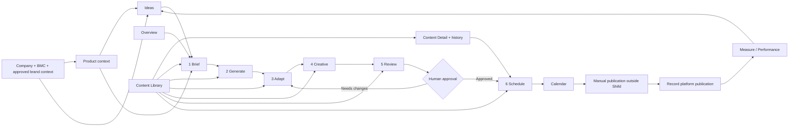

# Frontend Implementation Plan

Planning date: 2026-09-09. Status: design analysis and implementation proposal; no application implementation authorized by this document.

## 1. Sources, findings, and boundaries

Reviewed [AGENTS.md](../AGENTS.md), [frontend/AGENTS.md](../frontend/AGENTS.md), [PRD.md](PRD.md), [IMPLEMENTATION_NOTES.md](IMPLEMENTATION_NOTES.md), [DESIGN_RULES.md](DESIGN_RULES.md), the existing [DESIGN_DECISIONS.md](DESIGN_DECISIONS.md), and the frontend scaffold. Inspected every directory under `design-reference`, including both `screen.png` and `code.html` for all 14 screen exports and `precision_executive/DESIGN.md`.

**The PRD is empty (0 bytes).** No PRD requirements or PRD-versus-Stitch conflicts can currently be verified. The conflicts below compare Stitch against the implementation notes, other Stitch screens, and the available design guidance. They must be revisited when the PRD is populated. Missing PRD content is not permission to invent requirements.

The current frontend contains the Vue/Vite/TypeScript starter (`App.vue` renders `HelloWorld.vue`). Vue Router, Pinia, and Tailwind are required by the frontend instructions but are not yet declared in `frontend/package.json`. There is no existing application routing, domain store, or implemented product design to preserve.

Use the source priority in `DESIGN_RULES.md`: PRD behavior, implementation constraints, majority visual language, individual screenshot, individual HTML, then usability judgment. `precision_executive/DESIGN.md` is a useful design reference, not a higher-priority product specification; its prose and token front matter also disagree in places.

Confirmed constraints from the implementation notes:

- Vue 3 Composition API with `<script setup lang="ts">`, Vite, TypeScript, Vue Router, Pinia, and Tailwind.
- Frontend only, with local mock data and service boundaries that can later support APIs. No backend, database persistence, real authentication, AI API, or social API implementation.
- Supported publishing platforms are Instagram and LinkedIn. WhatsApp Business is supplementary inbound inquiry tracking.
- AI produces copy, adaptations, and visual direction. People create final visuals externally and upload PNG/JPG files; uploads use browser-local previews.
- AI alignment assessment is advisory. Final approval is human; overriding an alignment warning requires a justification.
- Scheduling records intent. Publication occurs manually outside Shifd, followed by an explicit action recording that publication occurred.
- Preserve the six user-facing steps: **Brief → Generate → Adapt → Creative → Review → Schedule**.

Routes, component boundaries, mock schemas, and missing screen treatments below are proposals. Rows marked **Review** depend on product or information-architecture decisions and must not be treated as approved scope. Visual normalization can follow `DESIGN_RULES.md`; meaningful implemented deviations must subsequently be recorded in `DESIGN_DECISIONS.md`. This planning pass does not record proposed patterns as already implemented decisions.

## 2. Complete screen inventory and route proposal

Reference paths below are relative to `design-reference/`. Each screen row represents an inspected PNG/HTML pair. Proposed view files live in `frontend/src/views/`.

| ID | Reference directory / screen | Proposed route | Proposed Vue view | Design and navigation interpretation |
| --- | --- | --- | --- | --- |
| S01 | `overview_shifd_marketing` — Overview | `/overview` (`/` redirects here) | `OverviewView.vue` | Execution KPIs, weekly platform cadence, upcoming-content table, secondary performance snapshot. Platform → Overview. |
| S02 | `content_ideas_shifd_marketing` — Content Ideas | `/content/ideas` | `ContentIdeasView.vue` | KPI strip, status filters, idea table, Add Idea drawer defined in HTML. Content Studio → Ideas. |
| S03 | `create_content_brief` — Create Content / Brief | `/content/new` → first Brief entry; `/content/:contentId/workflow/brief` after draft creation | `content/ContentBriefView.vue` inside `content/ContentWorkflowView.vue` | Step 1 form with context inspector. Entry can be blank or prefilled from an idea/product. Content Studio → Create Content. |
| S04 | `creative_assets_shifd_marketing` — Creative Assets | `/content/:contentId/workflow/creative` | `content/ContentCreativeView.vue` | Step 4: visual-direction column and platform asset workbench. This is part of Create Content, not a new global Assets section. |
| S05 | `content_library_shifd_marketing` — Content Library | `/content/library` | `ContentLibraryView.vue` | Filtered lifecycle repository, row selection, batch toolbar, contextual inspector. Content Studio → Content Library. |
| S06 | `content_detail_audit_shifd_marketing` — Content Detail & Audit | `/content/:contentId` | `ContentDetailView.vue` | Approved content preview, caption, context, generation metadata, and history. Child destination of the library; this approved-state screen is not the missing Review step. |
| S07 | `content_calendar_shifd_marketing` — Content Calendar | `/calendar` | `ContentCalendarView.vue` | Week calendar, cadence, manual-release panel, publication confirmation modal in HTML. Month is an exposed control without a separate design. Planning & Insights → Calendar. |
| S08 | `marketing_performance_shifd_marketing` — Marketing Performance | `/performance` | `MarketingPerformanceView.vue` | Date/platform controls, metrics, charts, cadence, WhatsApp inquiry summary, per-content table. Planning & Insights → Performance. |
| S09 | `company_context_shifd_marketing` — Company Context | `/context/company` | `context/CompanyContextView.vue` | Profile & Strategy tab, editable foundation, positioning, audiences, BMC summary, context preview. Context Engine → Company. |
| S10 | `business_model_canvas_shifd_marketing` — Business Model Canvas | `/context/company/business-model` | `context/BusinessModelCanvasView.vue` | Company child tab; preserve nine-cell canvas arrangement and synthesis preview. Not a new sidebar item. |
| S11 | `brand_kit_architecture_shifd_marketing` — Brand Kit, Design Tokens & Enterprise UI Architecture | **Review:** candidate `/context/company/brand-kit` | **Review:** `context/BrandKitView.vue` | Actual export is a design-system/specification page. It is not a demonstrated Brand Voice & Guardrails editor. Product placement and whether it is an application screen require review (C02). |
| S12 | `products_shifd_marketing` — Products & Context Specification | `/context/products`; selection via `?productId=:productId` | `context/ProductsView.vue` | Product cards plus selected-product specification panel. Retains the provided master/detail concept. Add/Edit form and “Open Product Context” destination are unresolved (C03). |
| S13 | `integrations_shifd_marketing` — Integrations & Data Feeds | `/settings/integrations` | `settings/IntegrationsView.vue` | Channel cards, manual metric entry, recent entries. Much of the supplied integration functionality exceeds scope; final page composition requires review (C04–C05). |
| S14 | `ai_system_shifd_marketing` — AI & System | `/settings/ai-system` | `settings/AiSystemView.vue` | Model parameter form, M1–M4 cards, guardrails, usage, logs, simulation dialog in HTML. All operational behavior must be simulated; governance claims require review. |
| R01 | `precision_executive` — `DESIGN.md` only | None | None | Additional design-system reference, not a fifteenth application screen. This directory has no PNG/HTML pair. |

### Required workflow views without dedicated exports

These complete the six steps expressly required by the implementation notes. Their detailed layouts and validation must be reviewed; no screenshot exists for these views.

| Step | Proposed route | Proposed view | Reuse and missing design work |
| --- | --- | --- | --- |
| 2 — Generate | `/content/:contentId/workflow/generate` | `content/ContentGenerateView.vue` | Reuse Brief context inspector, copy panels from Detail, and simulation feedback from AI & System. Need candidate selection/editing, generating/error/retry states, and a clear way forward. Candidate count and regeneration behavior are unspecified. |
| 3 — Adapt | `/content/:contentId/workflow/adapt` | `content/ContentAdaptView.vue` | Reuse platform tabs and caption preview from Detail; prepare Instagram/LinkedIn copy and visual directions. Need editable adaptation layout, platform/format selection, and completion rules. |
| 5 — Review | `/content/:contentId/workflow/review` | `content/ContentReviewView.vue` | Reuse Detail preview, asset sequencer, context panel, and timeline. Add advisory assessment, human approval, and justification for warning override. Approval controls are absent from the supplied approved-state Detail design. |
| 6 — Schedule | `/content/:contentId/workflow/schedule` | `content/ContentScheduleView.vue` | Reuse Calendar release summary and approved asset/caption preview. Need date/time/timezone fields and per-platform scheduling layout; Calendar shows the destination, not the complete scheduling form. |

Use named routes and route metadata for page title, breadcrumbs, active sidebar key, and workflow step. Keep filter/search/page/view selection in query parameters where useful; do not put captions or form payloads into URLs. Reserve static `ideas`, `library`, and `new` route names when resolving content IDs. Unknown IDs and unavailable in-memory drafts need a clear empty/not-found state and a recovery link.

An entry at `/content/new?ideaId=…` or `?productId=…` should initialize one local draft with a stable ID, then replace the URL with its Brief route. Never create a fresh record on every step navigation. Direct links to later steps must load the same content and explain missing prerequisites; they must not bypass approval. This is a routing proposal, not a new content lifecycle decision.

### Secondary states and overlays

| State | Evidence | Proposed component and ownership |
| --- | --- | --- |
| Add Idea drawer | S02 HTML: `idea-drawer`, 480px, initially translated offscreen | `IdeaEditorDrawer.vue` on Ideas; Overview Capture Idea navigates to `/content/ideas?action=new`. Fields are listed in section 7; requiredness remains open. |
| Library inspector | S05 PNG and HTML: `inspector-panel` | `ContentInspector.vue`, selected via `?selected=:contentId`; full details navigate to S06. |
| Selected product context | S12 visible right panel | `ProductContextPanel.vue`; current selection is URL-addressable. Add/Edit treatment is proposed, pending field/schema review. |
| LinkedIn custom assets | S04 HTML: `customLinkedinDrawer` | Inline `PlatformAssetCollection.vue`, revealed when reuse is off. Despite its name, this is not an overlay drawer. PDF content conflicts with scope. |
| Manual publication confirmation | S07 HTML: `publish-modal` | `ManualPublishDialog.vue`; confirms a platform-specific external publication, optional live URL, current mock actor. |
| AI simulation | S14 HTML: `simulationModal` | `PromptSimulationDialog.vue`; deterministic mock progression, result, cancellation, and error/retry states. |
| Image preview/replacement | S04 eye/replace/remove controls | `AssetPreviewDialog.vue` and file picker; no dedicated open-state export. |
| Approval warning override | Required by implementation notes, no export | `AlignmentOverrideDialog.vue` or a clearly grouped section in Review; justification must be retained with human decision. Layout subject to Review design approval. |
| Weekly metric/inquiry entry | S08 action labels; S13 inline metric form | Shared `WeeklyMetricsForm.vue` and proposed `InquiryEntryDialog.vue`; schema and ownership require C10 review. |

## 3. Proposed frontend architecture

```text
frontend/src/
  components/
    app/          AppShell, AppSidebar, AppHeader, PageHeader, PageContainer
    ui/           Buttons, fields, cards, badges, tabs, table, dialogs, drawers
    content/      Workflow, copy, assets, approval, scheduling, idea components
    context/      Company, BMC, product, inherited-context components
    performance/  Metrics, charts, cadence, inquiry summary and entry components
  views/
    content/      Workflow parent and six step views
    context/      Company, BMC, Products, conditional BrandKit view
    settings/     Integrations, AI & System
    ...           Overview, Ideas, Library, Detail, Calendar, Performance
  router/         Named routes, navigation configuration, route metadata
  stores/         Shared domain state and cross-view actions
  data/           Normalized mock fixtures, vocabularies, simulation scenarios
  types/          Domain models and service request/response contracts
  composables/    Form drafts, workflow guards, object URLs, clipboard, filters
  services/       Typed service interfaces and in-memory mock adapters
```

Views coordinate screen composition. Domain components present and edit typed data through props/emits. Pinia owns shared entities and cross-screen actions. Mock adapters provide asynchronous service contracts with controllable loading/failure scenarios. Components never import large fixture arrays or manipulate DOM nodes to represent business state.

Keep tokens in the central frontend stylesheet/Tailwind theme during implementation. Use shared semantic names rather than copying each export's Tailwind configuration. Use local, deliberate logo/avatar/fixture assets; the export URLs are not a stable application asset pipeline. Do not reproduce the marketing slide HTML as an image generator: approved previews display uploaded or seeded image files.

Use native/browser functionality where suitable (file input, clipboard, object URLs, downloads, date formatting). Select extra chart, table, or drag-and-drop dependencies only if the approved interactions require them. No dependency installation or application scaffolding is part of this planning task.

### Shared application shell components

| Component | Responsibility and canonical behavior |
| --- | --- |
| `AppShell` | Own one sidebar/header/main layout and overlay stacking. Main content accounts for the header once; avoid copied `pt-16`/`py-*` overlap. |
| `AppSidebar` / `AppNavItem` | Shared logo lockup, existing five navigation groups, route-derived active state, footer identity/settings shortcut. Expanded width proposed at 256px to match all screen HTML; optional compact rail at 64px. |
| `AppHeader` | Shared 64px header, workspace identity, global search affordance, notification/help controls, user display. Keep the majority placement; search/help behavior is a scope question, not permission to add modules. |
| `PageContainer` | Fluid main content with 1600px cap and consistent gutters; explicit wide workbench and stacked responsive behavior. |
| `PageHeader` / `AppBreadcrumbs` | One title/description/action layout; breadcrumbs derived from routing. Allow wrapping without compressing the title to a narrow column. |
| `CompanyContextLayout` / `ContextSectionTabs` | Company profile and BMC tab navigation; Brand Voice & Guardrails relationship remains pending. |
| `ContentWorkflowView` / `ContentWorkflowHeader` | Own content identity, six-step navigation, save state, shared context, and nested view outlet. |
| `WorkflowActionBar` | Back, Save Draft, Continue or step-specific primary action; common placement and disabled/busy treatment. Approval is a specific human action, never a generic “Continue” side effect. |
| `ContextInspectorLayout` | Consistent main/inspector relationship for Brief, Library, Products, and Detail without forcing identical column ratios on distinct workbenches. |
| `AppOverlayHost` / `AppToastRegion` | Accessible dialog/drawer mounting above shell and consistent success/error feedback. |

Preserve these sidebar groups and ordering: Platform (Overview); Content Studio (Ideas, Create Content, Content Library); Planning & Insights (Calendar, Performance); Context Engine (Company, Products); System (Integrations, AI & System). Do not add Brand Kit, BMC, Creative, campaigns, or Approvals to the sidebar without approval. Detail belongs to Content Library; workflow children belong to Create Content; company children belong to Company.

## 4. Reusable UI components and repeated patterns

| Layer / components | Shared uses and behavior |
| --- | --- |
| `BaseButton`, `IconButton`, `AppIcon` | Primary, secondary, ghost, destructive; size, loading, disabled, focus, accessible icon label. Use real links for navigation. |
| `BaseInput`, `BaseTextarea`, `BaseSelect`, `FormField`, `FieldError` | Typed bindings, labels, helper/error text, required indicators only for approved rules, read-only and dirty states. |
| `BaseCheckbox`, `BaseRadioGroup`, `BaseSwitch`, `BaseRange` | Table selection, context/objective choices, asset reuse, model parameters. Clickable chips must expose radio/checkbox semantics. |
| `BaseCard`, `SectionHeader`, `MetricCard`, `ProgressMeter` | White surfaces, consistent headers/body/action slots; shared KPI and readiness displays. |
| `StatusBadge`, `PlatformBadge`, `TagChip`, `VersionLabel` | Separate lifecycle, platform, taxonomy, and technical metadata. A score badge never grants human approval. |
| `BaseTabs`, `SegmentedControl`, `FilterBar`, `SearchField`, `DateRangeControl` | Navigation tabs versus view/filter toggles; search, context/pillar/platform/status/date filters. |
| `DataTable`, `TableSelection`, `Pagination`, `RowActionMenu` | Shared semantics, selection, empty/loading states, visible horizontal overflow, per-column content slots. No duplicate table engine per screen. |
| `BaseModal`, `BaseDrawer`, `ConfirmDialog`, `ToastMessage` | Shared focus management, escape/close behavior, title/body/footer, pending and failure states. |
| `EmptyState`, `LoadingState`, `InlineAlert`, `ErrorState` | Empty repositories, missing context, no filter results, upload/generation failures, advisory warnings. |
| `FileUpload`, `AssetThumbnail`, `AssetGallery`, `AssetPreviewDialog` | PNG/JPG selection/drop, preview, sequence, remove/replace, keyboard reorder, platform-specific collections. |
| `Stepper`, `WorkflowActionBar`, `SaveStatus` | One six-step model across all workflow views; current, complete, available, unavailable/error states. |
| `CopyPanel`, `PlatformCopyEditor`, `PlatformPreview`, `VisualDirectionPanel` | Copy/edit/preview text and structured slide direction across Generate, Adapt, Creative, Review, Detail, and Calendar. |
| `ContextSelector`, `ContextAnchorCard`, `InheritedField`, `ReadinessSummary` | Company/product scope and inheritance, source/version display, completeness and advisory feedback. |
| `BmcCell`, `BmcSummary`, `ProductCard`, `ProductContextPanel` | Company canvas, product catalog, and Brief contextual summaries. |
| `AlignmentAssessmentPanel`, `HumanApprovalPanel`, `AuditTimeline` | Separate assessment, decision, and recorded events. Review and Detail share presentation but expose different actions. |
| `CadenceCard`, `CadenceGrid`, `CalendarEventCard`, `ManualReleasePanel` | Overview, Calendar, Schedule, and Performance derive different presentations from shared schedule/publication data. |
| `ChartCard`, `LineChart`, `BarChart`, `ChartLegend`, `InquirySummary` | Responsive data-driven charts, differentiated series and accessible text/table equivalents. |

Repeated composition patterns:

1. Page header → KPI strip → filters/tabs → table or workbench: Overview, Ideas, Library, Performance, Integrations, AI & System.
2. Main editing/preview area plus contextual inspector: Brief, Products, Library, Detail. Creative retains its visual-direction/asset split; Calendar retains its calendar/release split.
3. Company-level foundation with product overlays: Company → Products → Brief → assessment/history. Show inherited versus overridden values and capture the source version used for a draft.
4. Platform-specific copy and ordered assets: Adapt → Creative → Review → Detail → manual-release panel. All show the same content entity and platform variants.
5. Status plus count plus contextual next action: idea readiness, lifecycle tabs, upcoming rows, calendar events. Derive counts and available actions rather than copying screenshot labels.
6. Advisory score/progress plus explanation: brief quality, context completeness, alignment, cadence. Keep these different measurements explicitly named.
7. Local draft editing → save feedback → error/retry recovery. Saving a form must change mock state; a toast alone is not a save implementation.
8. Copy/export actions use the currently displayed record and filters. Report clipboard/download errors honestly; do not copy the Calendar HTML's success-like clipboard fallback.

## 5. Inconsistency audit and proposed canonical patterns

These are proposed visual standards using the priority and consistency rules in `DESIGN_RULES.md`. Product-impacting cases are separately tracked in section 10.

| Area | Observed inconsistency / evidence | Proposed canonical pattern and rationale |
| --- | --- | --- |
| Sidebar dimensions | All 14 HTML shells use `w-64` (256px); Precision Executive prose specifies 240px expanded / 64px collapsed. | Use 256px expanded, matching the majority actual screen references; 64px compact rail if implemented. One shell variable controls sidebar, header offset, and main inset. |
| Sidebar identity and active state | Ideas, Company, Products, and Calendar highlight Create Content. Library screenshot highlights both Overview and Content Library because its script adds an active class without clearing the original. Several later screens omit nav icons/active styling. | Preserve the common icon-and-label sidebar and highlight exactly one route-derived item with blue `#1D4ED8`/white text and `aria-current`. Restore icons consistently. No navigation restructuring is required to fix this. |
| Top navigation | The header is largely identical, but “Execution Engine” is repeated regardless of page; page breadcrumbs alternate between full workspace paths, terse uppercase paths, and no path. Search remains “prompt drafts, campaigns, assets” even where those destinations are undefined. | Keep the shared 64px workspace header and control order. Put one route-derived breadcrumb row in `PageHeader`; use consistent casing. Retain workspace identity; review global search scope and the module label in C11 before claiming working campaign search. |
| Typography | Ideas/Library/Creative/Integrations use 24px headings; Brief/Overview/Performance/AI use 32px. Performance and some step labels use bold 700 despite Precision Executive's 400/500/600 discipline. Detail truncates its title; technical mono text is overused. | Inter 400/500/600; page title 32/40, section title 20/28, card title 16/24, body 14/20, secondary 13/18, labels 12/16, compact metadata 11/14. Mono 12/16 for IDs/code only; metrics use tabular numerals. Wrap page titles and essential labels. Use the shared display token for page hierarchy. |
| Spacing and header fit | Headers on Ideas and Performance squeeze titles beside wide action bars. Most content starts very close to the fixed header. Exports mix `space-*`, raw utilities, and global first/last-child margin overrides. | Use a 4/8px scale; 24px desktop / 16px tablet/mobile gutters, 24px section gaps, 16/20px card padding, 8px label-to-field gaps. Separate shell header offset from content padding. Header actions wrap into their own row when needed. |
| Colors / design source disagreement | Precision Executive prose uses warm `#FAFAFA`, slate text, and `#E2E8F0` borders; its front matter and screen exports use cool `#F8F9FF`, `#EFF4FF`, `#0B1C30`, and `#0037B0`. | Prefer the cool majority screen palette: canvas `#F8F9FF`, white surface, subtle well `#EFF4FF`, text `#0B1C30`, secondary `#434655`, CTA `#1D4ED8`, active link `#0037B0`. Use a subtle consistent structural border and verify actual contrast; do not inherit Brand Kit certification/contrast claims. |
| Card styling / elevation | Screens use borderless `shadow-sm` cards and multiple tinted wells; Precision prose requires hairline borders/no resting shadow; Brand Kit says “zero external border reliance.” Brief includes ambient glow HTML. | White 8px-radius cards, restrained hairline border, no resting shadow; subtle blue wells inside only where grouping helps. Reserve shadows for popovers/dialogs. Preserve the quiet screen identity; remove decorative glow. Log meaningful surface normalization on implementation. |
| Radius tokens | HTML redefines `DEFAULT=2px`, `lg=4px`, `xl=8px`, `full=12px`; Precision front matter uses conventional values and real circular `full`. Calendar modal uses `rounded-2xl`. | Semantic radius tokens: 4px micro, 6px controls/tags, 8px cards, 12px dialogs, `9999px` avatars/dots/pills. Never redefine “full” to a finite 12px. |
| Buttons | Header controls vary among 32/36/38/40px and padding-only heights. Some CTAs have shadows, some very dark blue; Creative uses tiny 28px image actions. | Default button 36px to match common `h-9` controls, compact toolbar 32px, workflow primary 40px. One blue primary, white/outlined secondary, subtle/ghost tertiary, explicit destructive treatment. Enlarge icon hit areas on touch; no duplicate plus sign plus add icon. |
| Form controls | Company/Integrations use 36px fields, Brief/Ideas 40–44px, AI selects 44px. Controls alternate white/tinted fills, missing borders, and `focus:outline-none`. Several visual “fields” are static divs. | Shared 36px default field, explicit 40px comfortable workflow variant, 6px radius, consistent subtle fill/border and visible blue focus ring. Use real labels, native inputs, accessible errors and read-only display variants. Editable field set/requiredness is subject to C03/C07; visual appearance does not establish a schema. |
| Status badges | Draft appears pale blue/gray; Needs Review is red on Overview but amber in Precision prose; ready/approved/synced use unrelated green shapes. “Verified,” “100% passed,” and signed badges blur different concepts. | One lifecycle badge dictionary: neutral Draft, blue Generated/Adapted/Creative in Progress, amber Ready for Review, green Approved/Published, informational blue Scheduled; red for errors/failed checks. Use consistent 22px-minimum pill, text plus optional icon/dot. Keep assessment, connection, and lifecycle badges separate. Do not silently merge status meanings (C08). |
| Page widths / inspectors | Brand Kit caps at 1600px, Detail 1540px, Integrations 1400px, others uncapped. Library uses a 384px inspector; Precision suggests 360px. Calendar and Library visibly lose useful columns/content. | Single 1600px main cap, fluid below it; 360px default inspector with 24px gap when space allows. Keep distinct screen workbench ratios. Move inspectors to an accessible overlay or stacked panel at constrained widths instead of shrinking primary content indefinitely. |
| Modal/drawer patterns | Ideas uses a 480px right drawer; Calendar a `max-w-lg` 16px-radius dialog; AI a `max-w-xl` 8px-radius dialog. Detail uses native `alert()`. Hidden markup lacks a shared focus/keyboard contract. | Preserve drawer for sustained editing and centered modal for confirmation/simulation. Shared 12px radius, 24px padding, 480/560px dialog sizes, 480px editor drawer, scrollable body, close control, backdrop, focus trap/return, Escape and pending-state rules. Use a shared dialog instead of native alert. |
| Tables | Overview has clipped status/actions; Library's inspector squeezes most columns offscreen; Performance clips its rightmost columns. Row padding/density, header casing, striping and selection vary; scrollbars are globally hidden. | Shared semantic table with subtle header fill, 12px labels, 16px horizontal padding, minimum 44px simple rows and content-sized multiline rows. Preserve column order and essential actions; expose horizontal scrolling and an inspector trigger. Use consistent hover/selection styles and pagination, with keyboard-operable menus. |
| Workflow stepper | Brief uses six numbered tiles, subtitles, and a progress track. Creative combines campaign breadcrumb, check circles and connecting lines in an overflowing strip; Review/Schedule are clipped in its PNG. | Use Brief's full six labeled steps as the canonical model, adding a check indicator for completed steps from Creative. Put content/campaign identity on a separate line. All six labels remain reachable on mobile through visible horizontal scrolling or a compact labeled step navigation; no hidden-overflow clipping. Progress describes navigation/completion, not AI approval. |
| Tabs / chip semantics | Company tabs, Ideas status tabs, Library lifecycle pills, platform previews, and Brief objective tiles use similar visuals for different actions. | Consistent tab visuals for mutually exclusive panels/routes, segmented controls for filters, radio/checkbox groups for form choices, badges for passive state. Each exposes correct semantics and keyboard behavior. |
| Responsive behavior | Exports fix sidebar/header offsets, hide scrollbars, and compress 7-day calendars and 5-column BMC grids. Screens provide desktop references only. | At ≥1280px use full workbenches where content fits; 768–1279px collapse/overlay navigation or inspectors as needed; below 768px use a navigation sheet and stacked content with 16px gutters. Preserve BMC cell identity/order and calendar dates; use accessible scrolling/compact agenda presentation where necessary. Avoid viewport-level horizontal overflow. |
| Feedback and interaction fidelity | Library inspector scripts replace only title/hook, Detail tabs change styling without content, Calendar publish emits only a toast, and several buttons have no handlers. | Treat scripts as intent clues, not complete behavior. Bind full records and computed state, update actual mock entities, provide busy/error/retry states, and preserve form data on failure. |

Record meaningful implemented deviations by affected screen, original inconsistency, chosen pattern, and reason in `DESIGN_DECISIONS.md`. Likely entries: shared shell/active state; common heading/surface/control tokens; responsive table/inspector behavior; common stepper; shared dialogs. Product-conflict decisions need a user decision first, then a corresponding record. Minor pixel adjustments can be grouped rather than logged individually.

## 6. Six-step content workflow and related-screen mapping

The broader product flow remains **Context → Idea → Brief → Generate → Adapt → Creative → Review → Approve → Schedule → Manual Publish → Measure**. Context and Ideas precede the wizard. Human approval occurs within the Review experience; it is not an extra numbered step. Calendar, Detail, and Performance support the workflow without becoming wizard steps.



The return-to-Adapt arrow illustrates a revision path, not a decision that all corrections must return there. Actual review correction targets and status effects require C08. Library links resume the stored applicable step.

| Step | Related inspected screens | Inputs → outputs | Major interactions and boundaries |
| --- | --- | --- | --- |
| 1 Brief | S03, S02 idea drawer/rows, S09–S10 context, S12 product panel | Selected idea/context snapshot + editable strategy → saved brief | Company/product toggle, product selection, pillar/objective, target audience/quick-add, topic, angle, tone/constraints, draft save, cancel, mocked thesis refinement. Preserve source idea/product link. Do not invent mandatory fields. |
| 2 Generate | S03 context/quality panel; S06 copy/metadata; S14 simulation | Saved brief + context snapshot → mock copy candidate(s) and visual direction | Generate/retry, inspect/select candidate, edit draft copy, save, continue to Adapt. No real model calls; generation never approves content or creates final images. Candidate structure and overwrite rules need review. |
| 3 Adapt | S06 platform tabs/caption; S04 platform asset requirements | Selected copy → Instagram and/or LinkedIn variants with selected formats and visual direction | Choose supported targets, edit captions/hashtags/CTA and slide outline, preview, save, regenerate only intentionally selected variant. Exact formats and limits remain C06/C07. |
| 4 Creative | S04 directly; S06 gallery/caption preview | Platform variants + visual brief + uploaded PNG/JPG → ordered platform asset collections | Copy visual brief, ordinary external Canva link, upload/preview/order/remove/replace files, toggle Instagram reuse for LinkedIn, custom LinkedIn images, draft save, return to Adapt, continue to Review. Reuse does not compile a PDF. Text-only eligibility and required asset count remain open. |
| 5 Review | S06 approved preview/history; S05 “Ready for Review”; S14 advisory feedback styling | Current copy/assets + advisory assessment → human decision with actor/time/revision and override justification if needed | Inspect both platforms and all slides, show warnings, correct content, explicit human approval. High AI score cannot set Approved. The approval layout, roles, and invalidation rules remain open. |
| 6 Schedule | S07 calendar/manual-release summary; S06 Schedule action; S05 approved inspector | Human-approved content revision → platform schedule records | Select date/time/timezone and platform, inspect final copy/assets, save schedule, open calendar. Proposed gate: only current approved revision is eligible, consistent with Calendar's explicit guardrail. This action never posts to a network. |

After step 6, Calendar opens the manual-release panel for a specific platform schedule. Copy/download actions help the person publish externally. “Mark as Published” opens the confirmation dialog; only its successful confirmation creates a local publication record. Publishing Instagram must not automatically mark LinkedIn published. Performance consumes those records and entered metrics; content-level rollup labels for partial scheduling/publication require C08.

Proposed shared flow safeguards, to formalize with the lifecycle decision:

- Keep `currentStep`, step completion, content lifecycle, advisory result, and human approval as separate concepts.
- Keep one content ID across Ideas, workflow, Library, Detail, Calendar, and Performance; related platform records reference it.
- Preserve entered values when navigating backward, retrying, or encountering validation errors.
- Reopening an approved or scheduled record must not silently replace approved copy/assets. Proposed version-aware invalidation and rescheduling behavior needs C08 approval.
- “Save Draft” in later stages saves edits; it must not automatically reset an approved/published lifecycle to Draft. Clarify labels and transition policy through C08.
- Use client-side route/action guards for prototype consistency, not as real authorization/security claims.

## 7. Required mock-data models

Domain types belong in `src/types/`; fixture records belong in `src/data/`. Use stable IDs, explicit references, timestamps and revision fields. All values and operational reports are mock data. Do not use screenshot titles as join keys.

| Model / proposed file | Essential proposed fields and relationships | Consumers / uncertainty |
| --- | --- | --- |
| `Workspace`, `User` / `workspace.ts` | Workspace ID/name/timezone; actor ID/display name/avatar/role label | Shell, save/approval/publication attribution. One mock workspace/user initially; no authentication or role-permission system inferred. Timezone default requires C10. |
| `CompanyContext` / `context.ts` | ID, organization name, business categories, industry, geography, website, mission, vision, positioning, value proposition, differentiators, audience/decision-maker/pain-point references, revision, updatedBy/At | Company, BMC summary, Products, Brief. This inventories visible fields; requiredness and which display blocks are editable need C03. |
| `Persona`, `PainPoint`, `ProofPoint` / `context.ts` | IDs; labels/descriptions; persona roles/segments; pain severity; proof claim/value/source reference and source version | Context anchors and generation fixtures. “Verified” in seed text is not evidence of a real claim. |
| `BusinessModelCanvas`, `BmcCell`, `BmcEntry` / `business-model.ts` | Company ID, revision, nine stable cell keys; entries with title/body; optional displayed weights and structured amounts | All nine cells: partners, activities, resources, value propositions, relationships, channels, segments, costs, revenue. Editing/reweight semantics require C03/C09. |
| `BrandContext` / `brand.ts` | Proposed tone guidance, preferred/prohibited terms, style rules, asset/token references, revision | Company → product inheritance and advisory checks. **Conditional schema:** Brand Voice & Guardrails editor is missing; do not equate app tokens with business brand rules (C02). |
| `Product` / `product.ts` | ID/companyId, name, description, display status, value proposition, feature hooks, personas, pain/solution pairs, proof points, CTA, approved angles, context revision, inheritance flags/overrides | Products, Brief, Ideas, Library filters. Product catalog conflicts across exports; choose fixtures after C03. Counts should derive from actual relationships. |
| `ContextSnapshot` / `context.ts` | Content ID, company/product IDs and revisions, resolved inherited values, source proof/persona references, capturedAt | Reproducible Brief/Review/Detail context without claiming a live vector database. Later context edits should not silently rewrite past records. |
| `ContentPillar`, `ContentObjective`, `Platform`, `ContentFormat` / `taxonomy.ts` | Stable keys and display labels; publishing `Platform` limited to `instagram` and `linkedin`; formats separate from platforms | Shared filters/forms. Pillar/objective/format vocabularies require C06; WhatsApp is a metric/inquiry source, not a publishing platform. |
| `ContentIdea` / `idea.ts` | ID, title, hook, company/product context, pillar/objective, suggested platforms/formats, advisory score, idea status, linkedContentIds, created/updated metadata | Ideas drawer/table, Overview Capture Idea, Brief prefill. Ready/in-pipeline/archive are idea concepts, distinct from content lifecycle. |
| `ContentItem`, `ContentBrief` / `content.ts` | ID, sourceIdeaId?, context snapshot ID, title/topic, pillar/objective, audience, angle/thesis, constraints/tone, currentStep, lifecycle, revision, author/time | Shared root record. Brief HTML has no clear required-field rules or platform control; treat schema validation as C07. |
| `GenerationRun`, `CopyCandidate`, `VisualDirection` / `generation.ts` | IDs/content revision, mock run state, candidate text, outline, visual concept, palette, format/dimensions, ordered slide directions, source IDs, optional mock usage/latency | Generate, Adapt, Creative, Detail, AI logs. Model labels are fixture labels, not recommendations or supported live-provider commitments. |
| `PlatformVariant` / `content.ts` | ID/contentId/platform, format, caption/body, hashtags, CTA, slide copy/outline, visualDirectionId, revision | Adapt, Creative, Review, Detail, Calendar. Character counts computed from actual text; platform caps must be specified before enforcement. |
| `CreativeAsset`, `PlatformAssetCollection` / `assets.ts` | Asset ID, variant/content reference, fileName, MIME, bytes, width/height, source (`seed`/`upload`), browser-local URL; collection ordered asset IDs and reuse source | PNG/JPG only for this phase. Keep runtime `File`/object URLs separate from serializable domain metadata. Define reuse/order propagation via C12. |
| `AlignmentAssessment`, `AssessmentFinding` / `review.ts` | Content revision, status/score?, criteria, warnings with location/reason, generatedAt, explicit advisory origin | Review and contextual feedback. Not human approval, legal compliance certification, or factual validation. |
| `HumanApproval`, `AuditEvent` / `review.ts` | Content/revision, actor, decision, timestamp, assessment reference, warning IDs, override justification; history event type and related entity IDs | Review, Detail, Calendar eligibility. Store justification when override occurs. Local history is not immutable, signed, or secure storage. |
| `ScheduleEntry`, `PublicationRecord` / `schedule.ts` | Content/variant/revision, platform, plannedAt/timezone, schedule state; publishedAt, recordedAt, recordedBy, optional live URL, method `manual` | Calendar, Overview, Library, Detail, Performance. Record publication independently per platform. |
| `WeeklyPlatformMetric`, `ContentPerformance`, `CadenceTarget` / `performance.ts` | Week/date range, platform, reach/impressions/followers/engagement inputs, source; publication-linked per-content metrics; per-platform target | Performance and Overview; definition of engagement rate, combined reach, and cadence aggregation needs C10. Distinguish unentered metrics from zero. |
| `InboundInquiry`, `WeeklyInquirySummary` / `performance.ts` | Date/week, WhatsApp source, intent category, optional source content/platform, count or individual inquiry record | Supplementary tracking only. Avoid contact pipelines/CRM entities; aggregate/manual-entry reconciliation requires C10. |
| `IntegrationSummary`, `MetricEntryRecord` / `settings.ts` | In-scope channel label, mock availability/status/check time; recorded metric values/week/actor | Integrations and Performance. No OAuth tokens, API secrets, webhook configuration, or CRM models. |
| `AiSettings`, `PromptStage`, `SimulationRun`, `SystemLogEntry` / `settings.ts` | Mock engine options, temperature/output settings, advisory term list, M1–M4 metadata, simulated results, usage and trace events | AI & System; do not model cryptographic authority or hard-coded regulatory guarantees as product behavior. |

### Fixture consistency rules

- Build one connected sample scenario around “Digital Approval vs Traditional Paper Approval” with one ID and coherent context, variants, assets, approval, schedule, and metrics. Additional records cover every proposed lifecycle/filter state.
- Seed Instagram-only, LinkedIn-only, shared-creative, separate-creative, and mixed platform publication cases. Whether LinkedIn text-only is a supported workflow path requires C06/C07.
- Include missing context, incomplete brief, partial upload, invalid file, mock generation failure, alignment warning, justified human override, empty results, and no metric data scenarios.
- Counts, progress, slide totals, characters, week labels, and relative timestamps derive from fixture state. Do not duplicate screenshot counters.
- Choose a deterministic fixture clock and use real date arithmetic. Calendar's “Mon 08 / Fri 12” for September 2026 is incorrect; September 8 is Tuesday and September 12 is Saturday. Performance uses 2024 dates; AI logs use 2025; content/calendar copy uses 2026.
- Keep full fixture datasets for pagination or derive count labels from the actual seeded subset. Ideas shows 24 total but five visible rows; Library shows 18 total and six visible rows. Those are not complete supplied datasets.
- Use browser object URLs for uploaded image previews; revoke them on removal/replacement/disposal only when no collection still references the asset. A refresh resets runtime uploads; do not imply durable autosave.
- No service adapter issues real network requests in this phase. Any “synced,” “generated,” cost, latency, or model diagnostic presentation must accurately identify simulated state where it matters to the action.

## 8. Required Pinia stores and state ownership

| Store | Shared state/actions | Screens and boundaries |
| --- | --- | --- |
| `useWorkspaceStore` | Mock workspace/user, display timezone, sidebar state | Shell and attribution. No auth/session security implementation. |
| `useContextStore` | Company, BMC, conditional brand context, products, personas/proofs; save context/product; compute resolved inheritance and create snapshots | Company, BMC, Products, Brief, Review, Detail. Do not copy resolved context into separate competing stores. |
| `useIdeasStore` | Ideas; add/update/archive after agreed policy; mark relationship to created content; computed counts | Ideas, Capture Idea, Brief entry. Idea-to-content linkage is updated once by an explicit action. |
| `useContentStore` | Normalized content/briefs/variants, current step/completion, generation records, assessments, human approvals, history; draft save, mock generation/adaptation, review action | Six workflow views, Library, Detail, Overview. Centralize allowed lifecycle transitions here after C08 review. |
| `useAssetsStore` | Asset metadata, ordered platform collections, runtime file registry/preview URLs; upload/remove/replace/reorder/reuse | Creative, Review, Detail, Calendar. Manage shared references and URL lifetime; no persistence plugin. |
| `useScheduleStore` | Per-platform schedules and manual publication records; schedule/reschedule after policy approval; confirm manual publication | Calendar, Schedule, Overview, Library, Performance. Eligibility reads approval/revision from Content; never maintains an independent Approved flag. |
| `usePerformanceStore` | Entered weekly/content metrics, inquiry records/summaries, cadence targets; save metric entry; derived series and reporting summaries | Performance, Overview, Integrations manual metrics. Publishing facts come from Schedule; don't create a second published-content repository. |
| `useSettingsStore` | In-scope mock integration summaries, AI parameter drafts/saved values, prompt stages, diagnostics/logs | Integrations and AI & System. Manual metric entries delegate to Performance, avoiding competing datasets. |
| `useUiStore` | Global toast queue and optional shared overlay state | App shell and cross-screen feedback. Keep ordinary component modal state local when no cross-screen ownership is needed. |

Composables should handle `useWorkflowGuards`, `useFormDraft`, `useContextInheritance`, `useAssetPreviews`, `useClipboard`, `useTableQuery`, and `useReportingPeriod`. Prefer computed getters/composables to an extra Overview/dashboard store that duplicates counts.

Use local component state for unsaved form buffers, open menus, active slide, and hover/tooltips. Use route queries for shareable filters, selected records and calendar range/view; avoid separately persisting the same query state in Pinia. Use Pinia for data needed across views. All state is in-memory by default; expose honest session-only save behavior. Refresh persistence is not assumed.

## 9. Major interactions by inspected screen

All described actions operate on local mock records or browser-local files. Conditional interactions remain subject to the conflict register.

| Screen | Interaction plan |
| --- | --- |
| S01 Overview | Capture Idea opens Ideas intake; Create Content starts Brief. KPI/weekly links apply relevant Library/Calendar filters. Upcoming rows route to Detail or the applicable workflow step according to state. Filter/export acts on upcoming records; Deep Analytics opens Performance. Cadence and totals update after manual publication. |
| S02 Ideas | Search title/hook; filter status/context/pillar/objective; paginate; open Add Idea drawer; choose company/product scope; edit title/product/pillar/hook/objective; save or proceed to Brief. Ready row Create Brief prefills a linked draft; In Progress resumes its linked content. Archive/edit actions need a defined row menu and idea-state policy. Resonance is advisory mock data. |
| S03 Brief | Toggle scope; conditionally choose product; select pillar/objective; enter audience/topic/angle/constraints; quick-add audiences; inspect source context and recent angles. Save draft, cancel with unsaved-edit handling, mock refinement, and Generate Content move into step 2. Persona browser has no detailed export (C11). |
| S04 Creative | Open external Canva link; copy visual brief; pick/drop multiple PNG/JPG files; inspect preview/dimensions; reorder by drag and keyboard; replace/remove; manage separate LinkedIn files or reuse Instagram files. Back/Save/Review retain the same content ID. Do not implement PDF compilation, real color-profile/contrast certification, or final-image generation. |
| S05 Library | Search/filter by context/pillar/platform/date/lifecycle; compute counts; paginate; select rows and show consistent inspector; open Detail or resume workflow. Copy current caption; schedule only eligible records. Export selected/filtered records with explicit scope. Batch Schedule, Tag Context, Archive, regeneration, and duplication semantics require C08/C11 before implementation. |
| S06 Detail & Audit | Navigate back to Library preserving query state; switch actual Instagram/LinkedIn preview data; select uploaded slide; copy caption; view source snapshot, advisory assessment and human history; navigate to Schedule when eligible. Regenerate returns to a deliberate revision flow. “Verify Sign & Seal” is a conflict, not a required crypto action. |
| S07 Calendar | Navigate dates/Today, choose week/month, filter platforms/statuses, select event, inspect release package. Schedule Content selects eligible content or enters its Schedule step. Copy caption, download available images, confirm manually published platform and optional URL; update records/counts. “Publish” button copy should clearly mean recording a manual publication. Rescheduling and month layout need specified states. |
| S08 Performance | Change reporting period/platform; update charts/table consistently; inspect series via keyboard/pointer; open Library/Detail for content. Log weekly metrics and WhatsApp inquiries through shared forms; export current report. Keep WhatsApp supplementary, with no inbox or CRM workflow. Exact metric fields/formulas require C10. |
| S09 Company | Edit confirmed profile/strategy fields, save/cancel, manage differentiator chips, inspect BMC summary, navigate full canvas/company tabs. Context preview and Sync/Test controls can simulate local computation only. Do not claim live knowledge ingestion or zero hallucinations. Brand tab destination unresolved. |
| S10 BMC | Inspect all nine cells; preserve five-column upper canvas with activities/resources and relationships/channels stacked, plus cost/revenue lower row. Save edits/export JSON after editing design is specified. Re-weight, simulation and prompt matrix are mocked/conditional; weighting must not invent product prioritization rules. |
| S11 Brand Kit | Review palette, typography, component specimens and identity rules. Copy/export actual local token/spec data only if this is approved as an application page. Figma library/CDN links require supplied targets. No invented certification, signature verification, or replacement brand editor. |
| S12 Products | Search/filter cards; choose product and update complete specification panel; inspect inheritance, feature/proof/CTA context; Create Brief prefills selected product. Add/Edit, company-tone override, Open Product Context, Hierarchy Graph and View Campaigns need C03/C11 decisions. Preserve the inspected split layout until those destinations are defined. |
| S13 Integrations | Present only an approved in-scope mock channel treatment; Test/Sync update simulated state with honest labels if retained. Shared metric form saves actual local entries and refreshes Performance. Export local entry history. OAuth, token-health operations, webhooks, CRM and vault behavior are not prototype capabilities. Final treatment of those panels requires review. |
| S14 AI & System | Change mock model/temperature/output settings; save/apply; manage advisory prohibited terms; simulate diagnostics/M1–M4 run; inspect/export local trace records. Busy/cancel/failure states reset cleanly. Human approval cannot be disabled. Credentials/cryptographic/regulatory controls require approved replacement or omission. |

Accessibility and verification are part of every screen: sensible heading order, visible focus, named icon actions, labels and field errors, keyboard-accessible tables/dialogs/asset reorder, sufficient contrast, reduced motion, readable responsive layouts, and real disabled/pending behavior.

## 10. Product conflicts and unresolved questions for review

**No direct PRD conflict is asserted:** the supplied PRD is empty. C01 blocks definitive PRD alignment. The other entries identify concrete conflicts with implementation notes or unresolved design/product relationships. Proposed options are review material, not unilateral resolutions.

| ID | Evidence / conflict | Established boundary | Decision or clarification needed |
| --- | --- | --- | --- |
| C01 — Missing PRD | `docs/PRD.md` contains no requirements. | Implementation notes provide some scope but not full field/workflow rules. | Supply/restore PRD or confirm a replacement requirements source, then reconcile this plan. Validate required fields, page scope, lifecycle, and success criteria. |
| C02 — Brand page identity / IA | Company/BMC tabs say “Brand Voice & Guardrails”; S11 is “Brand Kit, Design Tokens & Enterprise UI Architecture,” with UI specimens and no business voice editor. It has no obvious active nav/destination. | Navigation, IA, and product features require user approval. | Is S11 a developer reference, an application brand-kit page, or the intended third company tab? Is a separate brand voice editor required? The proposed `/context/company/brand-kit` route remains conditional. |
| C03 — Context/product editing and catalog | S12 exposes Add/Edit/Open Context but no editor export. Brief lists Approval/Vault/Sign/Identity; Ideas includes Analytics; Products/Library use Approval/Dossier. Several company “fields” are plain display blocks. | Do not infer required fields or create new page concepts without review. | Confirm product fixture catalog, editable fields and requiredness, whether the right panel is the full context editor, Add/Edit surface, and company-versus-product override rules. |
| C04 — Additional platforms and CRM | Ideas includes Twitter/X and a Technical Whitepaper in the Platform column; Integrations includes X and HubSpot CRM. Brand Kit lists GovBriefings/Press Kits/Technical Memos. | Only Instagram/LinkedIn publishing; WhatsApp supplementary tracking; CRM excluded. | Confirm the approved redesign/omission of conflicting UI panels and sample records. This phase cannot implement extra networks, CRM, or separate publishing products. Do not reinterpret formats as platforms. |
| C05 — Real integrations/security infrastructure | S13 advertises Graph API ingest, scopes/token expiry, WhatsApp webhooks, auto notifications, OAuth, AWS KMS/HSM credential vault. S14 has bearer credentials, vector DB and provider latency; many pages say Live/Synced. | Mock-only; no APIs, real auth, database or social integration. | Decide which panels remain clearly simulated versus are removed/replaced. Removing this much of Integrations changes a major page composition and needs review. Real secrets/connection flows remain excluded. |
| C06 — Creative formats and generation | S04 promises automatic LinkedIn PDF compilation and standalone PDF upload; S06 says slides were rendered/compiled. Library includes video/archive and LinkedIn text-only/article; Ideas mixes format names into platforms. | Final visuals are externally produced PNG/JPG; no AI image generation or Canva API. | Confirm allowed Instagram/LinkedIn formats, text-only path, carousel rules, and revised LinkedIn creative presentation. Do not add PDF/video tooling to satisfy a stray export. Canva is an ordinary external link. |
| C07 — Missing workflow forms and validation | Only Brief and Creative have dedicated exports. Brief lacks target-platform control and required markers. No approved Generate/Adapt/Review/Schedule form designs; Creative's “5 slides / 10MB” rules appear only in Stitch. | Six steps, local uploads, human approval, override justification are explicit; exact schemas are not. | Approve missing view layouts, where platform/format is chosen, required brief fields, candidate count, file-size/dimension/count policy, readiness checks, schedule/timezone fields, and what a text-only post needs to continue. Do not enforce unapproved screenshot limits as PRD rules. |
| C08 — Lifecycle and human approval | Library statuses include Draft/Generated/Adapted/Creative in Progress/Ready for Review/Approved/Scheduled/Published. Overview says Needs Review. Detail is already Approved with a crypto seal; AI M4 “signs” or strictly rejects content. Calendar says only human-reviewed approved content can be scheduled. | AI advisory; final approval human; warning override needs justification; publishing manual. | Confirm lifecycle vocabulary, approval actor/role, approval granularity, revision invalidation, return-for-changes path, archive/duplicate rules, batch eligibility, rescheduling/cancellation, and rollups for partly scheduled/published platforms. Proposed default is revision-bound human approval before scheduling; no automatic AI approval or cryptographic gate. |
| C09 — Product scope inflated into compliance platform | Brand Kit/AI/Detail/BMC assert RSA/ECDSA signing, immutable logs, NIST/FedRAMP certification, zero hallucinations, regulatory sanitizer locks and strategic grounding weights. S04 claims automatic contrast/color-profile/safe-margin certification. | Prototype has no secure persistence, regulatory validation, AI authority, or final image-generation system. | Confirm plain advisory assessment and ordinary human activity history treatment; decide which technical panels are retained as visibly simulated explanatory material. Mock image dimensions can be measured, but brand/legal/compliance “passes” cannot be asserted from that. |
| C10 — Measurement/date semantics | Performance says 2 posts/week/platform over 8 weeks but combined Published shows 15/16; cadence rows imply 15 IG + 16 LI = 31/32. Overview Published is 2 while weekly platform totals are 3. Date years conflict. Integrations mixes LinkedIn impressions, IG reach, and aggregate chats in one form; Performance has separate per-content/weekly metrics. | Manual publishing and supplementary inquiry tracking; metrics must derive from coherent mock records. | Define combined versus per-platform counts, cadence denominator, engagement-rate formula, non-deduplicated reach labeling, reporting timezone/week start, weekly-versus-content metric ownership, and aggregate-versus-individual inquiry reconciliation. Don't sum counts across different periods or double-count manually logged chats. |
| C11 — Undefined destinations and peripheral actions | Global search names campaigns; Products has View Campaigns/Hierarchy Graph; Brief has Persona Matrix; Company/BMC have sandbox/prompt-matrix links; Library has batch tagging/archive/regeneration; Brand Kit has Figma/CDN export controls. | No new navigation, IA, or product features without approval. | Confirm required prototype behavior and targets. Proposal: use existing filtered Library/context views where the meaning is truly equivalent; otherwise retain as unresolved rather than inventing campaigns/persona/design-tool modules. Global help/notifications/search detail is not specified. |
| C12 — Creative reuse semantics | S04 checkbox says reuse Instagram creative and describes compilation/synchronization; notes require reuse and separate platform assets but do not define edit propagation. | Reuse must work with PNG/JPG browser-local assets. | Confirm whether reuse is linked or a copy. Proposed linked asset IDs while reuse is on, preserved custom LinkedIn collection when off, explicit impact on approval if shared assets change. Avoid irreversible data loss when toggling. |
| C13 — Conflicting product claims / fixture truth | Company/BMC say 80% reduction and “45 days to 48 hours”; Brief/Products say 32%; Creative says 4.2 days; Detail says 4.8 days and different pilot volumes/agencies. Detail changes the repeated item's pillar to “Thought Leadership & Cost Analysis.” | Stitch sample copy is not verified product truth or authoritative taxonomy. | Confirm fixture facts, proof sources, personas and item taxonomy. Normalize sample data after review; don't silently convert generated marketing claims into real company assertions. |

Visual corrections in section 5 can be specified independently. Work depending on a conflict should wait for its review decision; unrelated foundational work can proceed once implementation is authorized. No major product conflict is resolved by this document.

## 11. Recommended implementation order and validation

| Phase | Work | Review dependency / completion evidence |
| --- | --- | --- |
| 0. Requirements reconciliation | Resolve PRD absence, Brand page role, missing workflow/field rules, platform formats, lifecycle and metric definitions. Agree which out-of-scope panels are redesigned. | Record decisions for C01–C13 as applicable; approve missing screen layouts before implementing them. |
| 1. Foundation and shell | Add required Router/Pinia/Tailwind setup, semantic tokens, shell, navigation metadata, base controls, cards, feedback, accessible modal/drawer/table patterns. | One active sidebar item, consistent layout/typography/focus, representative desktop/tablet/mobile shell. No imported Stitch production markup. |
| 2. Domain mocks and context | Define normalized types/fixtures/mock adapters and stores; implement Company, BMC, Products and any approved Brand surface. | One consistent context source, editable values retained in memory, inherited/snapshot values traceable; no fake live infrastructure. Depends on C02/C03. |
| 3. Idea → Brief → Generate → Adapt | Implement Ideas intake/filtering, stable draft entry, workflow shell, Brief and the approved missing Generate/Adapt designs. | End-to-end mock content creation retains ID/context and edits across navigation; failures/retries do not lose data. Depends on C06/C07. |
| 4. Creative production | Implement PNG/JPG uploads, previews, sequencing, replacement/removal, platform collections/reuse, visual-direction copying. | Browser-local files work across related views; invalid files explain failure; keyboard reorder and object-URL cleanup work. Depends on C06/C07/C12. |
| 5. Review, Library, Detail | Implement shared previews, advisory assessment, human approval/override, lifecycle repository/filtering/inspector/history. | Warning override requires justification; AI result never grants approval; revision/lifecycle behavior follows approved policy. Depends on C08/C09. |
| 6. Schedule and manual publication | Implement approved Schedule step, Calendar week/month behavior, per-platform release panel and publication confirmation. | Only eligible approval can schedule; changing time never posts; explicit manual confirmation updates only the intended platform. Depends on C07/C08/C10. |
| 7. Overview and Performance | Build derived dashboard metrics/cadence, weekly/content entry and inquiry tracking, data-driven charts, filters and exports. | Totals reconcile with content/publication/metric records; no fabricated deduplicated reach; missing data remains distinct from zero. Depends on C10/C13. |
| 8. Settings and final consistency pass | Implement reviewed Integrations and AI & System mock surfaces; complete allowed exports, responsive states, route recovery and design decision log. | No API/credential/CRM/crypto scope creep; all visible actions have approved behavior; compare each page against its PNG and canonical patterns. Depends on C04/C05/C09/C11. |

During each implementation phase, run `npm run build`, fix TypeScript/build errors, and verify the changed flow and responsive layouts. Use targeted automated checks for consequential behavior: approval/override and revision guards, per-platform publication, metrics aggregation, asset reuse/order/lifetime, and draft identity across routes. Do not add tests that merely duplicate static markup or every minor visual adjustment.

Final frontend acceptance should exercise a connected scenario: select product → capture idea → Brief → mock Generate → Adapt → upload/reorder/reuse creative → review warning → human approval with justification → schedule → manually publish outside the app → record publication → verify Library/Overview/Calendar/Performance consistency. Also exercise invalid uploads, failed generation, missing context, unknown routes, canceled dialogs, empty filters, keyboard navigation, and session-reset recovery.

## 12. Review summary

**Architecture:** one Vue application shell; named nested routes for six workflow views; context child views beneath Company; reusable domain/UI components; normalized in-memory Pinia state behind typed mock service adapters. Library, Detail, Calendar and Performance consume the same content and platform records.

**Design system:** preserve Stitch's cool light canvas, white surfaces, Inter type, restrained blue actions and grouped sidebar. Standardize shell sizing/active states, spacing, typography, controls, semantic badges, responsive tables/inspectors, overlays and the full six-step stepper.

**Unresolved questions:** empty PRD; Brand Kit versus Brand Voice placement; context/product and workflow schemas; formats and creative reuse; lifecycle/revision/human-approval rules; metric/timezone definitions; treatment of out-of-scope integration, CRM and cryptographic claims; undefined secondary destinations. See C01–C13 for evidence and review decisions.

**Implementation order:** requirements review → shell/tokens → models/context → Ideas/Brief/Generate/Adapt → Creative → Review/Library/Detail → Schedule/manual publication → Overview/Performance → reviewed settings and cross-screen validation.

This deliverable is documentation only. No frontend application code, dependencies, or implemented design decisions were changed.
